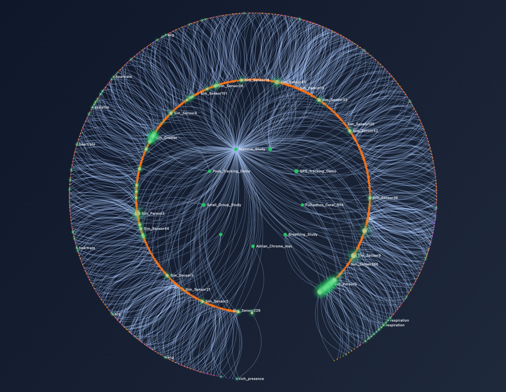
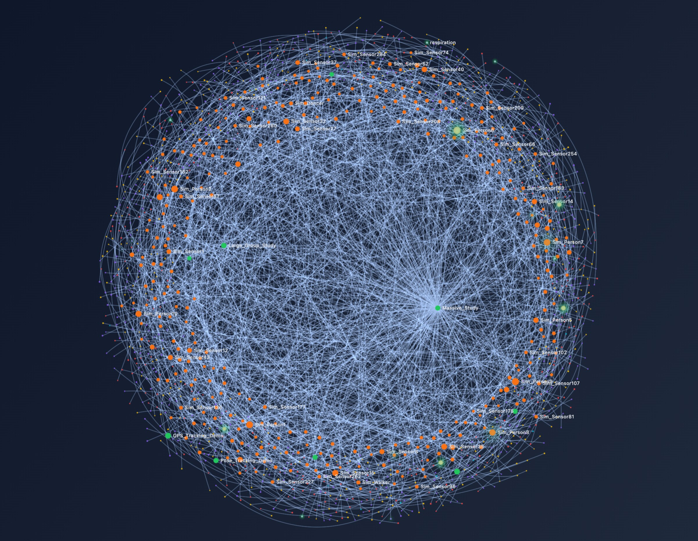

<p align="center">
  
</p>

<h1 align="center">SensOcto</h1>

<p align="center">
  <em>Feel someone's presence. Not their performance.</em>
</p>

<p align="center">
  A real-time sensor data platform that makes human connection visible — streaming ECG, heart rate, breathing, motion, and environmental data between people, places, and research tools.
</p>

---

<p align="center">
  
</p>

## What is Sensocto?

Sensocto connects wearable sensors, environmental monitors, and research instruments into a shared, real-time experience. Built on the science of **interpersonal physiological synchronization** — the finding that hearts, breathing, and nervous systems measurably align during meaningful human interaction — the platform turns invisible signals into shared awareness.

Stream a Movesense ECG at 100 Hz. Visualize GPS tracks from a cycling group. Monitor coral reef health through underwater hydrophones. Feel a meditation circle's breathing synchronize. All through the same platform, all in real-time.

### Who is it for?

| | |
|---|---|
| **Researchers** | Quantify group synchronization in meditation studies. Measure HRV responses to therapeutic interventions. Correlate physiological data with mood reports. |
| **Therapists** | Witness trust forming in a session through co-regulation dynamics. Support mental health with biofeedback and peer networks. |
| **Conservationists** | Monitor coral reef ecosystems with AI. Track marine migration via bioacoustics. Process live video inference on underwater feeds. |
| **Makers & Tinkerers** | Connect Nordic Thingy:52 via Web Bluetooth. Capture 9-axis IMU quaternions. Trigger actuators from sensor threshold rules. |
| **Friends & Communities** | Play sensor-driven party games. Create music from collective heartbeats. Breathe together and watch your sync grow. |

## Features

- **Real-time Sensor Streaming** — LiveView dashboard with sub-second updates for ECG, heart rate, HRV, respiration, IMU, GPS, temperature, and more
- **Attention-Aware Back-Pressure** — Intelligent batching that adapts to user viewport, focus, and system load
- **Collaboration Rooms** — Share sensor data with team members via QR codes, with video/voice calling
- **Sensor Network Graph** — Interactive visualization of sensor relationships and data flow
- **Composite Lenses** — Purpose-built views for heartrate, ECG waveforms, breathing, HRV, motion, gaze tracking, and battery monitoring
- **Sensor Simulation** — Built-in simulator with 50+ configurable virtual sensors for development
- **Multi-Language** — Available in English, German, French, Spanish, Portuguese, Japanese, Chinese, and Alsatian
- **P2P Sync** — Distributed room state via Iroh document sync
- **Hot Code Deployment** — Zero-downtime updates on Fly.io

<p align="center">
  
</p>

## Quick Start

```bash
# Install dependencies and set up database
cp .env.sample .env
# Edit .env with your credentials
source .env
mix setup

# Start the server
mix phx.server
```

Visit [http://localhost:4000](http://localhost:4000)

See [docs/getting-started.md](docs/getting-started.md) for detailed setup instructions.

## Technology Stack

- **Backend:** Elixir 1.19.4, OTP 28, Phoenix 1.8, Ash Framework 3.0
- **Frontend:** Phoenix LiveView 1.1, Svelte 5, Tailwind CSS, DaisyUI
- **Database:** PostgreSQL with Ecto
- **Real-time:** Phoenix Channels, PubSub, adaptive PriorityLens streaming
- **P2P:** Iroh distributed document sync
- **WebRTC:** Membrane RTC Engine with ex_webrtc
- **Sensors:** Web Bluetooth, WebSocket, HTTP — Movesense, Nordic Thingy, custom devices
- **Deployment:** Fly.io with hot code upgrades

## Documentation

| Document | Description |
|----------|-------------|
| [Getting Started](docs/getting-started.md) | Local development setup |
| [Architecture](docs/architecture.md) | System overview, OTP supervision tree |
| [Supervision Tree](docs/supervision-tree.md) | Mermaid diagrams of supervision tree |
| [Attention System](docs/attention-system.md) | Back-pressure and viewport tracking |
| [Scalability](docs/scalability.md) | Performance analysis and tuning |
| [Deployment](docs/deployment.md) | Fly.io deployment, hot code upgrades |
| [Simulator Integration](docs/simulator-integration.md) | Sensor simulation system |
| [BEAM VM Tuning](docs/beam-vm-tuning.md) | BEAM VM optimization guide |
| [Clustering Plan](docs/CLUSTERING_PLAN.md) | Distributed clustering roadmap |

## Project Structure

```
lib/
├── sensocto/              # Business logic
│   ├── infrastructure/    # Core infrastructure supervisor
│   ├── registry/          # Process registries
│   ├── storage/           # Iroh & room storage
│   ├── bio/               # Biomimetic layer
│   ├── domain/            # Domain supervisor
│   ├── otp/               # GenServers, supervisors
│   ├── lenses/            # PriorityLens, Router, adaptive streaming
│   ├── sensors/           # Ash resources
│   ├── rooms/             # Collaboration
│   ├── calls/             # WebRTC calling
│   └── simulator/         # Sensor simulation
└── sensocto_web/          # Web layer
    ├── live/              # LiveView modules
    ├── components/        # UI components
    └── channels/          # WebSocket handlers
```

## Research Foundation

Sensocto is informed by peer-reviewed research in interpersonal physiological synchronization:

- Sharika et al. (2024) — Heart rate synchrony predicts group decision-making accuracy with 70%+ reliability
- Gordon (2025) — Interpersonal synchrony research across human groups
- daSilva & Wood (2025) — Unified framework for synchrony: 6 dimensions, 4 core functions
- Palumbo et al. (2017) — Systematic review of interpersonal autonomic physiology

See the full list of 16 cited papers on the [About page](http://localhost:4000/about).

## Development

```bash
# Run tests
mix test

# Code quality
mix credo

# Interactive console
iex -S mix phx.server
```

## License

Proprietary
