# Sensocto LiveView Architecture

> Document for the Phoenix LiveView team. Overview of what we're building, how we use LiveView, and where we encounter friction.

## What is Sensocto?

Sensocto is a **real-time biometric sensor platform**. It connects wearable sensors (heart rate, ECG, IMU, eye tracking, breathing, etc.) to a web dashboard where multiple users can collaboratively view, analyze, and annotate live sensor data.

**Key characteristics:**
- **High-frequency data**: Sensors stream at 10-200Hz (ECG at 125-250Hz)
- **Many concurrent sensors**: 10-200+ sensors per session, each with multiple attributes
- **Collaborative**: Multiple users view the same data simultaneously (guided sessions, presence)
- **Multi-modal visualization**: Composite views (ECG waveforms, heart rate grids, 3D skeleton, gaze tracking, IMU orientation), plus media players, whiteboards, graphs
- **Adaptive quality**: System degrades gracefully under load (quality levels, backpressure)

## Codebase Scale

| Metric | Count |
|--------|-------|
| LiveView modules | 54 files |
| LiveView code | ~28,000 lines |
| Svelte components | 44 files (~24,000 lines) |
| JS hooks | ~30 hooks |
| Largest LiveView (lobby_live.ex) | 3,735 lines |
| Largest template (lobby_live.html.heex) | 2,428 lines |
| PubSub topics | ~15 distinct topic patterns |

## Architecture Overview

```mermaid
%% title: Sensor Data Flow
graph LR
    S[SimpleSensor GenServer] -->|PubSub: data:attention:high/med/low| R[Lenses.Router GenServer]
    R -->|ETS direct write| P[PriorityLens ETS tables]
    P -->|flush timer 64-500ms| PB[PubSub: lens:priority:socket_id]
    PB -->|handle_info| LV[LobbyLive LiveView]
    LV -->|push_event| H[JS Hook: CompositeMeasurementHandler]
    H -->|window CustomEvent| SV[Svelte Component]
```



### The Lens System

We built a custom "lens" routing layer between sensors and LiveViews to avoid O(N*M) PubSub subscriptions:

1. **Router** (`Lenses.Router`): Single GenServer subscribes to 3 attention-sharded PubSub topics, forwards to registered lenses
2. **PriorityLens** (`Lenses.PriorityLens`): Per-socket ETS buffers. Flushes batched data at adaptive intervals (64ms at `:high` quality, 500ms at `:minimal`). The hot data path bypasses the GenServer entirely (ETS tables are `:public`, writes happen in the Router's process).
3. **Attention Tracker**: Backend process that classifies sensors into attention levels (high/medium/low/none) based on which LiveViews are watching which sensors. Only sensors with viewers broadcast at all.

### Quality Adaptation / Backpressure

LobbyLive monitors its own mailbox depth and degrades quality when overwhelmed:

```
:high (64ms) → :medium (128ms) → :low (250ms) → :minimal (500ms) → :paused (stop)
```

Recovery is hysteresis-based: multiple consecutive healthy checks required before upgrading. Client-side health reports (JS hook) can trigger immediate downgrades but not upgrades.

## How We Use LiveView

### Session Structure

**Single `live_session`** for the entire app. All routes share one `ash_authentication_live_session` with `on_mount` hooks for auth, path tracking, and locale:

```elixir
ash_authentication_live_session :main_app,
  on_mount: [
    {LiveUserAuth, :live_user_optional},
    {SensoctoWeb.Live.Hooks.TrackVisitedPath, :default},
    {SensoctoWeb.Live.Hooks.SetLocale, :default}
  ] do
    live "/lobby", LobbyLive, :sensors
    live "/lobby/heartrate", LobbyLive, :heartrate
    live "/lobby/ecg", LobbyLive, :ecg
    # ... 18 more lobby sub-routes as live_actions
    live "/rooms/:id", RoomShowLive, :show
    # ... 30+ routes total
  end
```

### Layout-Level Persistent LiveViews

The app layout (`app.html.heex`) embeds several `live_render` calls with `sticky: true`:

```heex
{live_render(@socket, SensoctoWeb.SearchLive, id: "global-search", sticky: true)}
{live_render(@socket, SensoctoWeb.ChatSidebarLive, id: "chat-sidebar-live", sticky: true)}
{live_render(@socket, SensoctoWeb.TabbedFooterLive, id: "tabbed-footer-live", sticky: true)}
{live_render(@socket, SensoctoWeb.SenseLive, id: "bluetooth", sticky: true)}
```

These persist across navigation within the `live_session`. The Bluetooth `SenseLive` manages Web Bluetooth connections (sensors connect via the browser). The chat sidebar and footer persist UI state.

### Component vs Process Tradeoff

We went through two approaches for rendering sensor tiles in the lobby grid:

1. **`live_render` per sensor** (`StatefulSensorLive`): Each sensor tile is its own LiveView process. Pro: isolated state/crash. Con: 200 sensors = 200 processes with separate WebSocket frames. Virtual scrolling becomes expensive (mount/unmount processes).

2. **`live_component` per sensor** (`StatefulSensorComponent`): Single parent process, components are just function calls with state. Pro: way less overhead for virtual scrolling. Con: parent LiveView becomes a bottleneck, all data flows through one process.

We currently use **approach 2** (`@use_sensor_components true` flag) with a `send_update` pattern: the parent LobbyLive receives data from PriorityLens and fans out via `send_update(StatefulSensorComponent, id: "sensor_#{id}", flush: true)`.

### Svelte Integration via LiveSvelte

We use [`live_svelte`](https://github.com/woutdp/live_svelte) to render Svelte 5 components inside LiveView templates. Svelte handles the high-frequency visualization (ECG waveforms, sparklines, 3D graphs, maps) while LiveView handles state management and data delivery.

**How it works:**
- `esbuild-svelte` compiles `.svelte` files
- `live_svelte` generates hooks that mount/update Svelte components
- LiveView pushes data via `push_event` to JS hooks
- Hooks dispatch `window.CustomEvent`s that Svelte components listen to

**Seed data handshake** (race condition solution):
1. LiveView sends `push_event("composite_seed_data", ...)` with historical data
2. JS hook buffers events in `window.__compositeSeedBuffer`
3. Svelte component dispatches `composite-component-ready` CustomEvent when mounted
4. Hook replays buffer to component

### JS Hooks We Maintain

We have ~30 hooks. The most complex ones:

| Hook | What it does | Why it's complex |
|------|-------------|------------------|
| `CompositeMeasurementHandler` | Bridges LiveView push_events to Svelte components | Seed buffering, delta decoding (ECG), multi-component dispatch |
| `VirtualScrollHook` | Infinite scroll for sensor grid | Reports visible range to LiveView, triggers `send_update` for visible components |
| `ClientHealthHook` | Reports frame timing, event processing latency | Feeds backpressure system |
| `MediaPlayerHook` | YouTube playback sync across users | Full state machine (INIT→LOADING→READY→SYNCING→PLAYING), autoplay handling, drift correction |
| `Object3DPlayerHook` | 3D Gaussian splat viewer with camera sync | Camera position polling, user control detection |
| `CallHook` | WebRTC calls via Membrane | Audio/video tracks, speaking detection, quality tiers |
| `LobbyPreferences` | localStorage ↔ LiveView sync | Persists layout, sort, mode preferences |

### PubSub Usage

Major topic patterns:

| Topic | Publisher | Subscriber | Frequency |
|-------|----------|------------|-----------|
| `data:attention:{level}` | SimpleSensor | Lenses.Router | 10-250Hz per sensor |
| `lens:priority:{socket_id}` | PriorityLens | LobbyLive | 2-16 flushes/sec |
| `presence:all` | Presence | LobbyLive | On join/leave |
| `attention:lobby` | AttentionTracker | LobbyLive | On level changes |
| `room:{id}` | RoomServer | RoomShowLive | On room updates |
| `room:{id}:mode_presence` | Presence | LobbyLive/RoomShowLive | On mode changes |
| `media:{room_id}` | MediaPlayerServer | LiveViews | Playback sync |
| `guidance:{session_id}` | SessionServer | LobbyLive | Guide commands |
| `whiteboard:{room_id}` | WhiteboardServer | LiveViews | Drawing strokes |

## Friction Points & Wishlist

### 1. LiveView Process as Bottleneck for High-Frequency Data

**The core tension**: LiveView's process model is great for most UI, but our lobby handles 100+ sensors streaming at 10-250Hz. All data must flow through one LiveView process's mailbox.

**What we built to work around it:**
- Custom ETS-based buffering layer (PriorityLens) that batches data before hitting the LiveView
- Mailbox depth monitoring with automatic quality degradation
- Drain-all pattern: when backpressure hits, we drain ALL pending `{:lens_batch, _}` messages from the mailbox in one `handle_info`
- Client-side health reporting for adaptive quality

**What would help:**
- A way to push events to the client **without going through the LiveView process**. Something like a "data channel" that bypasses the LiveView mailbox but still uses the same WebSocket connection. We'd love to write directly from ETS to the WebSocket.
- Or: a way to have the LiveView process yield/batch multiple `handle_info` messages before diffing. Currently each `handle_info` triggers a diff check. If we could say "process these 50 messages, then diff once", that would be huge.

### 2. `push_event` is Our Main Data Path (Not Assigns)

For high-frequency data, we never use assigns. Instead:

```elixir
push_event(socket, "composite_measurement", %{
  sensor_id: sensor_id,
  attribute_id: attr_id,
  payload: value,
  timestamp: ts
})
```

We have dozens of `push_event` calls per flush cycle. The data goes straight to JS hooks and never touches the DOM diff. **But** every `push_event` still goes through the LiveView process and WebSocket framing.

**Friction**: There's no way to batch multiple `push_event` calls into a single WebSocket frame. Each `push_event` in a `handle_info` gets sent individually. We'd love a `push_events(socket, [{event1, payload1}, {event2, payload2}, ...])` that batches them.

### 3. Virtual Scrolling with LiveComponents

We show 100-200 sensor tiles in a scrollable grid. Only ~20-40 are visible at once. We implement virtual scrolling via a JS hook that reports the visible range, and the parent only `send_update`s visible components.

**Friction:**
- LiveComponents don't have a "sleep/wake" concept. Invisible components still exist in memory with full state. We can't tell LiveView "don't track diffs for these components until they're visible again."
- When scrolling fast, there's a visible blank flash because `send_update` for newly-visible components takes a round trip.
- We can't dynamically mount/unmount LiveComponents without re-rendering the parent template. The parent template always renders all components; we just skip `send_update` for invisible ones.

### 4. Giant LiveView Modules

`lobby_live.ex` is 3,735 lines. `room_show_live.ex` is 3,973 lines. These handle: sensor data routing, media player sync, 3D viewer sync, whiteboard sync, WebRTC calls, guided sessions, presence, virtual scrolling, quality adaptation, and more.

**Why they're so big:**
- `handle_info` receives messages from many PubSub topics (sensors, media, whiteboard, calls, guidance, presence)
- `handle_event` handles events from many UI elements (toolbar, lenses, modals, settings, guided session controls)
- Each "lens" (heartrate, ECG, IMU, etc.) needs its own data processing path in `handle_info`

**What would help:**
- A pattern for composing `handle_info` and `handle_event` handlers from multiple modules. We use `import` for helper functions, but the actual callback clauses must be in the LiveView module. Something like `use SensoctoWeb.MediaPlayerHandlers` that would inject `handle_info`/`handle_event` clauses.
- Or: nested LiveViews that can receive PubSub messages directly without forwarding through the parent. Currently `live_component` can't subscribe to PubSub (no process), and `live_render` creates a separate socket (can't share state easily with parent).

### 5. Seed Data / Historical Data on Navigation

When a user navigates to a composite view (e.g., `/lobby/ecg`), we need to send historical data (last 30 seconds of ECG samples) so the chart isn't empty. This is a burst of data on `handle_params`.

**Current approach:**
```elixir
def handle_params(%{"lens" => "ecg"}, _uri, socket) do
  # Fetch last 30s from AttributeStoreTiered
  # Push via push_event("composite_seed_data", %{...}) for each sensor
end
```

**Friction:**
- `handle_params` must return `{:noreply, socket}` synchronously, but fetching historical data can be slow
- We push many `push_event`s in one `handle_params` — they all queue up
- The Svelte component might not be mounted yet when seed data arrives (race condition solved by the buffering handshake above, but it's complex)

### 6. send_update for High-Frequency Component Updates

We use `send_update(StatefulSensorComponent, id: "sensor_#{id}", flush: true)` to trigger measurement flushes in components. With 40 visible sensors, that's 40 `send_update` calls every 100ms.

**Friction:**
- `send_update` is not cheap — it involves message passing and component re-render
- No way to batch `send_update` calls ("update these 40 components, then diff once")
- Components receiving `send_update` with only a `:flush` flag still go through the full update lifecycle

### 7. Svelte ↔ LiveView Boundary

The `live_svelte` library works well for rendering Svelte components, but the data flow is awkward for high-frequency updates:

- LiveView → JS Hook → `window.CustomEvent` → Svelte component (3 hops)
- There's no direct LiveView → Svelte data pipe
- We use `window.__compositeSeedBuffer` globals and `window.dispatchEvent` as a poor man's event bus
- `push_event` payloads are JSON-serialized, which adds overhead for binary data (ECG samples)

**What would help:**
- Binary push_event support (avoid JSON serialization for numeric arrays)
- Or: a way for hooks to receive events directly without the LiveView process intermediary

### 8. Process Lifecycle Mismatch with Browser State

The LiveView process can restart (deploy, crash, reconnect) but the browser holds state (Bluetooth connections, IndexedDB data, media playback position, WebRTC calls). On reconnect:

- Svelte components are destroyed and recreated (losing internal state like chart zoom, scroll position)
- JS hooks' `mounted()` fires again, but the old state in closures is gone
- We need to re-seed historical data, re-sync media playback, re-establish WebRTC

**Current mitigation:** Extensive `localStorage` persistence and the `LobbyPreferences` hook that restores state on mount. But it's fragile.

### 9. No Streams for Our Use Case

LiveView Streams are designed for lists that get appended/prepended. Our use case is a **grid of independent components**, each receiving continuous updates. Streams don't help because:

- We need random-access updates to any component (not append/prepend)
- Components have complex internal state (measurement buffers, sparklines, attention levels)
- The data changes are via `push_event`, not assign changes

We'd love a "stream-like" primitive that lets us efficiently update subsets of a large collection without re-rendering the parent.

### 10. Template Size & Conditional Rendering

`lobby_live.html.heex` is 2,428 lines with large `:if` blocks for each lens view. The entire template is compiled as one unit. When `live_action` changes (e.g., `:sensors` → `:ecg`), LiveView diffs the entire template even though only one branch changed.

**What would help:**
- Lazy-evaluated template blocks that only compile/diff when their condition is true
- Or: a way to split a template into sub-templates that are independently tracked

## Tech Stack Summary

- **Phoenix**: 1.8.3
- **LiveView**: 1.1.19
- **Elixir**: 1.19.4, OTP 27
- **Frontend**: Svelte 5 via `live_svelte`, esbuild, Tailwind + DaisyUI
- **Key JS deps**: chart.js, three.js, maplibre-gl, membrane-webrtc-js, gaussian-splats-3d, graphology
- **Auth**: `ash_authentication` (email/password, magic link, guest tokens)
- **Data**: Ash Framework + PostgreSQL
- **Real-time**: Phoenix PubSub, Presence, custom ETS-based lens system

## Summary

We love LiveView and have built a complex real-time platform on it. The main friction comes from **high-frequency data flowing through a single process bottleneck** — the LiveView process. We've built extensive infrastructure around this (ETS buffering, backpressure, quality adaptation), but the fundamental constraint is that all client communication must go through the LiveView process's mailbox and the single WebSocket connection.

The second area of friction is **composition** — large LiveViews that handle many concerns become hard to maintain, and there's no clean way to split `handle_info`/`handle_event` across modules or to have components that can independently subscribe to data sources.
