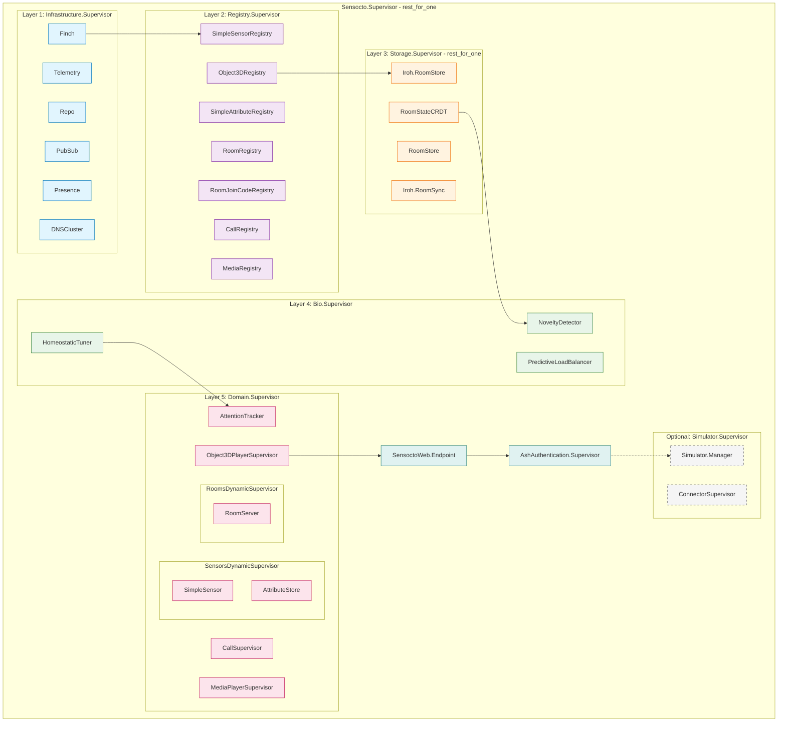
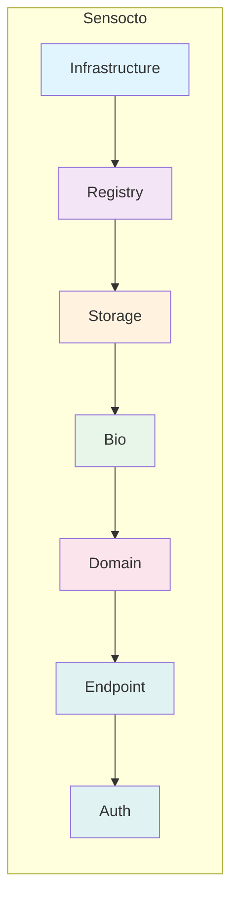
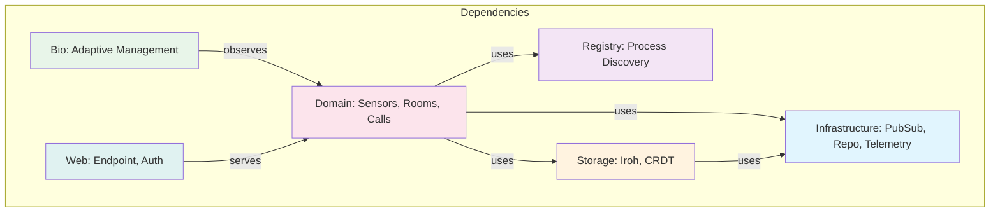

# Supervision Tree Visualization

This document provides a visual representation of Sensocto's OTP supervision tree architecture.

## Mermaid Diagram

## Simplified View

## Layer Dependencies

## Strategy Rationale

| Supervisor | Strategy | Reason |
|------------|----------|--------|
| Root (Sensocto.Supervisor) | `rest_for_one` | Later layers depend on earlier ones |
| Infrastructure | `one_for_one` | Children are independent |
| Registry | `one_for_one` | Registries don't depend on each other |
| Storage | `rest_for_one` | RoomStore depends on Iroh.RoomStore |
| Bio | `one_for_one` | Observers are independent |
| Domain | `one_for_one` | Dynamic supervisors are independent |

## Blast Radius

| Crash | Impact |
|-------|--------|
| Single sensor | Only that sensor restarts |
| Sensor registry | Brief lookup failure, rooms unaffected |
| Storage layer | All storage restarts, domains continue |
| Infrastructure | Full cascade restart, clean recovery |
