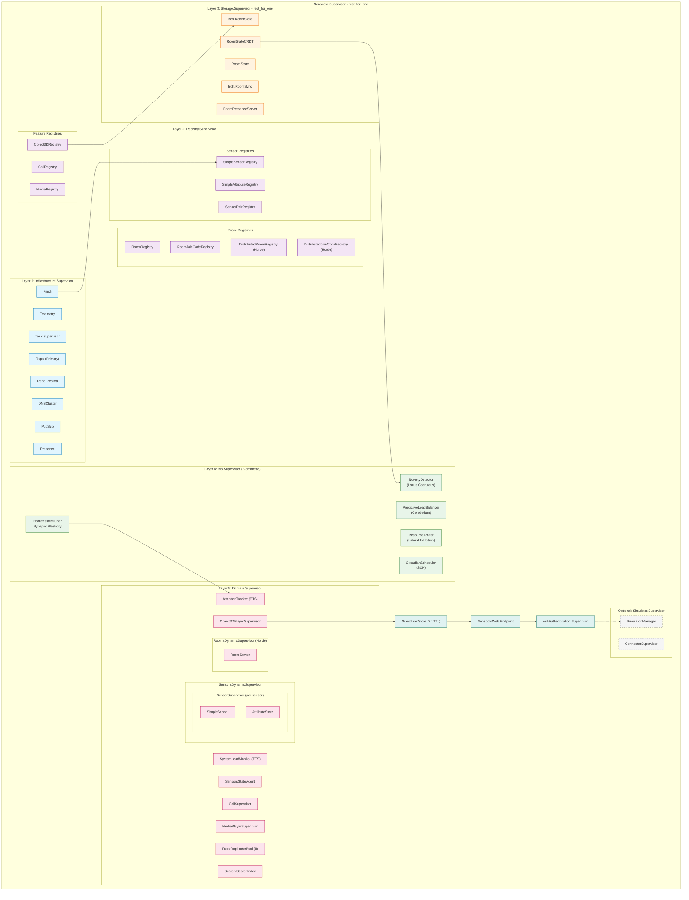
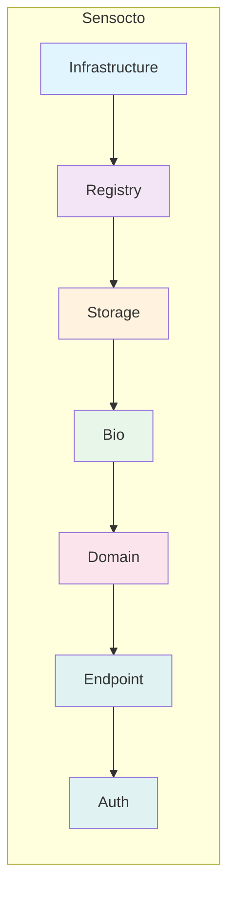
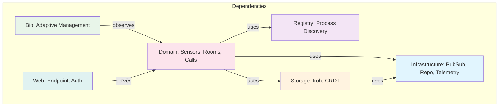

# Supervision Tree Visualization

This document provides a visual representation of Sensocto's OTP supervision tree architecture.

**Last Updated:** January 2026

## Mermaid Diagram

## Simplified View

## Layer Dependencies

## Strategy Rationale

| Supervisor | Strategy | Reason |
|------------|----------|--------|
| Root (Sensocto.Supervisor) | `rest_for_one` | Later layers depend on earlier ones |
| Infrastructure | `one_for_one` | Children are independent |
| Registry | `one_for_one` | Registries don't depend on each other |
| Storage | `rest_for_one` | RoomStore depends on Iroh.RoomStore |
| Bio | `one_for_one` | Observers are independent |
| Domain | `one_for_one` | Dynamic supervisors are independent |

## Blast Radius

| Crash Location | Impact | Recovery Time | Affected Users |
|----------------|--------|---------------|----------------|
| Single SimpleSensor | Only that sensor restarts | ~100ms | Users viewing that sensor |
| Single RoomServer | Only that room restarts | ~200ms | Room members |
| Sensor registry | Brief lookup failure | ~500ms | All sensor lookups |
| Room registry | Brief lookup failure | ~500ms | Room joins/lookups |
| Bio.NoveltyDetector | Novelty detection offline | ~100ms | None (advisory only) |
| Iroh.RoomStore | All storage processes restart | ~2s | Room state operations |
| PubSub | Full infrastructure cascade | ~5s | All users |
| Repo | Full infrastructure cascade | ~5s | All users |

## ETS Tables (Fast Path Lookups)

| Table | Owner | Purpose |
|-------|-------|---------|
| `:attention_tracker` | AttentionTracker | O(1) attention level queries |
| `:system_load` | SystemLoadMonitor | O(1) load metrics |
| `:novelty_detector` | NoveltyDetector | O(1) anomaly scores |

## PubSub Topics

| Topic Pattern | Publisher | Subscribers |
|---------------|-----------|-------------|
| `sensor:SENSOR_ID:data` | SimpleSensor | LiveViews |
| `attention:SENSOR_ID` | AttentionTracker | SimpleSensor |
| `system:load` | SystemLoadMonitor | AttentionTracker |
| `rooms:cluster` | RoomsDynamicSupervisor | LiveViews |
| `sensors:global` | SensorsDynamicSupervisor | LiveViews |
| `bio:novelty:SENSOR_ID` | NoveltyDetector | AttentionTracker |
