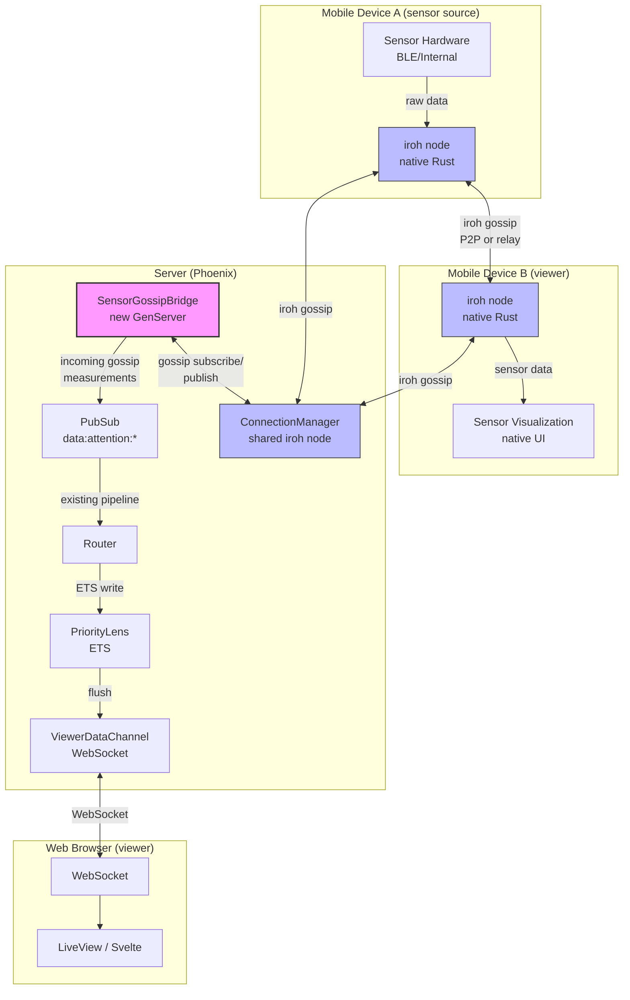

# Iroh Integration -- Team Report
*Last updated: 2026-03-08*

## Goals

1. **Complete the half-built room state CRDT sync** so media playback, 3D viewer, and presence state synchronize between multiple server instances and (eventually) directly to clients.
2. **Consolidate the 4 separate iroh nodes into 1** via the `IrohConnectionManager` pattern. **DONE.**
3. **Bridge sensor data to iroh gossip** for native clients (mobile, edge), while keeping the Phoenix PubSub path for web LiveView.
4. **Use iroh-blobs for historical sensor data distribution** so seed data for composite lenses does not always hit PostgreSQL.
5. **Achieve production readiness** by resolving the Linux x86_64 NIF build blocker for Fly.io.

---

## Current Status (2026-03-05)

### What Has Changed Since 2026-03-01

**iroh modules**: No changes. The iroh code in `lib/sensocto/iroh/` has been stable since the ConnectionManager consolidation (commit `4d12618`, 2026-02-08). All 5 modules (`connection_manager.ex`, `room_store.ex`, `room_sync.ex`, `room_state_crdt.ex`, `room_state_bridge.ex`) are unchanged.

**iroh_ex dependency**: Updated to `~> 0.0.16` (Hex). NIF binary targets include `aarch64-apple-darwin`, `x86_64-apple-darwin`, `aarch64-unknown-linux-gnu`, `x86_64-unknown-linux-gnu`, and `x86_64-pc-windows-msvc`. The `NodeConfig` struct now includes a `secret_key` field (enforced key), which may resolve the identity persistence blocker.

**Significant surrounding changes (Mar 1 - Mar 5):**

- **Fullscreen 3D object viewer** (commit `076abf7`): Improvements to the Object3D viewer and graph visualizations. The 3D viewer is one of the state types synchronized via `RoomStateBridge` -> `RoomStateCRDT`. No change to the iroh integration pattern.

- **PriorityLens: respiration added to high-frequency attributes** (commit `076abf7`): `@high_frequency_attributes` in `priority_lens.ex` now includes `"respiration"` alongside `"ecg"`, `"button"`, and `"buttons"`. This means respiration waveform data now accumulates in lists (preserving all samples between flushes) rather than keeping only the latest value. This increases per-flush payload size for respiration sensors and is relevant to the delta encoding opportunity (#5) -- respiration data could benefit from the same delta encoding as ECG.

- **Composite lens tuple now 9 elements**: `extract_composite_data/1` in `lobby_live.ex` returns a 9-tuple: `{heartrate, imu, location, ecg, battery, skeleton, respiration, hrv, gaze}`. The HRV and gaze lenses were added in earlier commits but are now stable. These are additional data types flowing through the same `SimpleSensor -> PubSub -> Router -> PriorityLens -> LobbyLive` pipeline.

**Key takeaway:** The platform continues to grow in features (fullscreen 3D, graph improvements) and the data pipeline is handling more data types (respiration as high-frequency, HRV, gaze). All of this is pure server-mediated. iroh remains in its "foundation laid but not actively used" state. The expanding data types make the eventual case for delta encoding (#5) stronger -- more high-frequency attributes means more bandwidth to save.

### Module-by-Module Assessment

| Module | Lines | Status | Verdict |
|--------|-------|--------|---------|
| `Iroh.ConnectionManager` | 216 | **Functional** | Single shared iroh node. Synchronous init. All other modules get `node_ref` from here. |
| `Iroh.RoomStore` | ~508 | Functional, tested indirectly | Uses shared node from ConnectionManager. CRUD works. `list_all_rooms` broken (always empty). New namespaces every restart. |
| `Iroh.RoomSync` | 352 | Functional | Good debouncing and retry logic. Hydration from iroh docs never actually loads anything (because `list_all_rooms` returns empty). |
| `Iroh.RoomStateCRDT` | ~735 | Functional, tested | Full Automerge API (media, 3D, presence). Uses shared node from ConnectionManager. In-memory only (docs lost on restart). |
| `Iroh.RoomStateBridge` | ~425 | **Functional (both directions)** | Local-to-CRDT via PubSub. CRDT-to-local applies media state (play/pause/seek) and object3d state. Echo suppression via sentinel message pattern. |
| `Storage.Backends.IrohBackend` | 289 | Functional | Secondary backend behind PostgreSQL. Properly delegates to `Iroh.RoomStore`. |
| `P2P.RoomTicket` | 322 | Functional | Generates deterministic tickets via HMAC. Caches in ETS. Good deep link / QR code support. |
| `BridgeChannel` | 166 | Functional | WebSocket bridge for sidecar. Topic pub/sub works. |
| `IrohGossipLive` | 319 | Demo/test page | Creates 50 nodes (!), connects them, sends messages. Useful for testing but resource-heavy. |
| `RoomMarkdown.GossipTopic` | ~360 | Functional (unsupervised) | Per-room gossip topics. Uses shared node from ConnectionManager. Not started in any supervisor. |
| `RoomMarkdown.CrdtDocument` | ~470 | Functional (unsupervised) | Full room-as-document Automerge support. Uses shared node from ConnectionManager. Not started in any supervisor. |

### Supervision Tree (Storage Layer)

```
Storage.Supervisor (:rest_for_one, 3/5s)
  |-- Iroh.ConnectionManager     -- shared iroh node (MUST start first)
  |-- Iroh.RoomStore             -- low-level iroh document storage
  |-- HydrationManager           -- multi-backend hydration coordinator
  |-- RoomStore                  -- in-memory room state cache
  |-- Iroh.RoomSync              -- async persistence (writes to Iroh.RoomStore)
  |-- Iroh.RoomStateCRDT         -- Automerge CRDT state for rooms
  |-- RoomPresenceServer         -- room presence tracking
```

### Sensor Data Pipeline (Current Architecture)

The pipeline has zero iroh involvement and is highly optimized:

```
SimpleSensor GenServer
  |-- put_attribute/put_batch_attributes cast
  |-- AttributeStoreTiered: ETS write (hot data)
  |-- PubSub broadcast: "data:{sensor_id}" (per-sensor, always)
  |-- Attention gate: if attention_level != :none
  |     |-- PubSub broadcast: "data:attention:{high|medium|low}"
  |     |-- Source-side batch throttling under elevated+ system load
  |     |     (buffer measurements, flush as batch on interval)
  |
Router GenServer (singleton)
  |-- Subscribes to 3 attention topics (demand-driven: only when lenses registered)
  |-- Writes directly to PriorityLens ETS tables (bypasses GenServer mailbox)
  |
PriorityLens GenServer
  |-- 4 ETS tables: buffers, sockets, digests, sensor_subscriptions (all :public)
  |-- Reverse index: sensor_id -> MapSet<socket_id> (O(1) lookup)
  |-- High-frequency attributes (ecg, respiration, button, buttons): accumulate lists
  |-- Other attributes: keep-latest-only
  |-- Flush timer per socket: broadcasts to "lens:priority:{socket_id}"
  |-- Quality levels: high(64ms), medium(128ms), low(250ms), minimal(500ms), paused
  |-- Delta encoding integration: maybe_delta_encode_batch/1 on flush (feature-flagged OFF)
  |
LobbyLive LiveView (per-browser-tab)
  |-- Subscribes to "lens:priority:{socket_id}" (personalized stream)
  |-- Receives :lens_batch or :lens_digest events
  |-- Push events to Svelte 5 components for rendering
```

Key efficiency features:
- **Attention-aware routing**: Sensors with `attention_level: :none` do not broadcast to the attention-sharded topics at all
- **Demand-driven subscriptions**: Router only subscribes to attention topics when PriorityLens has registered sockets; PriorityLens only registers with Router when browser tabs are connected
- **GenServer-free hot path**: Router writes directly to PriorityLens ETS tables, no mailbox contention
- **Source-side batch throttling**: Under elevated+ system load, SimpleSensor buffers measurements and flushes as batches (configurable intervals by load_level x attention_level)
- **Mailbox self-protection**: SimpleSensor drops measurements when its own mailbox exceeds 500 messages
- **Hibernation**: Sensors with low/no attention hibernate after 5 minutes of inactivity

### Sensor Registry Architecture (Stable)

- **Local lookup**: `SimpleSensorRegistry` (Elixir `Registry`, unique keys) -- used by `via_tuple`
- **Cluster discovery**: `:pg` process groups (scope `:sensocto_sensors`) -- used by `get_device_names/0`
- **Rooms/Connectors**: Use `Horde.Registry` for cluster-wide distributed lookup
- **Discovery module** (`lib/sensocto/discovery/`): ETS-cached read path with background `SyncWorker`

### Architectural Issues

**RESOLVED: 4 separate iroh nodes consolidated into 1.** The `Iroh.ConnectionManager` GenServer owns the single shared iroh node. All 4 consumer modules (`RoomStore`, `RoomStateCRDT`, `GossipTopic`, `CrdtDocument`) use `ConnectionManager.get_node_ref()`.

**RESOLVED: RoomStateBridge now bidirectional.** The CRDT-to-local direction is implemented with echo suppression. Media state (play/pause/seek) and object3d state sync from CRDT to local servers.

**POSSIBLY UNBLOCKED: Node identity persistence.** Previously blocked because `iroh_ex` v0.0.15's `NodeConfig` had no `secret_key` field. The v0.0.16 `NodeConfig` struct now includes `secret_key` as an enforced key. **Needs validation**: test that passing a `secret_key` to `NodeConfig.build/1` actually results in the same node identity across restarts. The `ConnectionManager.build_node_config/0` must be updated to persist and restore the key.

**Zero cross-node synchronization works today.** Despite the Automerge and gossip infrastructure, no data actually synchronizes between separate server instances because:
- Each restart creates a new node identity (blocked, see above)
- Namespace IDs are ephemeral
- `automerge_sync_via_gossip/2` requires connected peers, but no connection is established between instances

**GossipTopic and CrdtDocument are orphaned.** These two modules exist in `lib/sensocto/room_markdown/` and are functional code, but they are not started in any supervisor. They properly use ConnectionManager but are effectively dead code.

### What Actually Works Well

- **Automerge primitives are solid.** The NIF provides map, list, text, counter operations. Tests pass. Document creation, forking, saving, loading, and merging all work.
- **Circuit breaker integration.** All iroh calls go through `Sensocto.Resilience.CircuitBreaker`, preventing cascading failures when the NIF is unavailable.
- **Graceful NIF detection.** Every module checks `function_exported?(Native, :create_node, 2)` and degrades to `nif_unavailable: true` state rather than crashing.
- **Room ticket generation.** Deterministic HMAC-based namespace derivation means the same room always gets the same ticket parameters.
- **NodeConfig has `discovery` field.** The `build_node_config/0` in ConnectionManager sets `discovery: ["n0", "local_network"]`, which is needed for node discovery to work.

---

## Ranked Opportunities (Effort-to-Impact)

### Opportunity 1: IrohConnectionManager -- Single Shared Node -- DONE
**Status: COMPLETE (2026-02-08)**

### Opportunity 2: Complete RoomStateBridge Bidirectional Sync -- DONE
**Status: COMPLETE (2026-02-08)**

### Opportunity 3: Persist Node Identity and Namespace IDs -- POSSIBLY UNBLOCKED
**Impact: HIGH (enables real P2P continuity)**
**Effort: 2-4 hours** (iroh_ex v0.0.16 now has `secret_key` in NodeConfig -- needs validation)
**Needs Linux NIF: No (but matters more in production)**

**What:** Store the iroh node's secret key to disk on first run, restore it on subsequent runs. Also persist the mapping of `room_id -> namespace_id` so documents survive restarts.

**What's already built:** `RoomTicket` already derives deterministic namespace identifiers via HMAC. The architecture doc specifies a `priv/iroh/node_identity` file path.

**What's changed since last report:** iroh_ex v0.0.16's `NodeConfig` struct now includes `secret_key` as an enforced key. `NodeConfig.build/0` defaults it to `""`. The `generate_secretkey/0` NIF function exists and can presumably be passed to `NodeConfig.build(secret_key: key)`.

**What's needed:** (1) Validate that non-empty `secret_key` in NodeConfig produces deterministic node identity. (2) Add persistence code to `ConnectionManager`: generate key on first start, store to `priv/iroh/node_secret.key`, restore on subsequent starts.

**Honest assessment:** This is likely a half-day task now, down from "blocked." The iroh_ex v0.0.16 upgrade appears to have resolved the API gap. This is the prerequisite for Phase 1 of the P2P sensor data routing plan.

### Opportunity 4: Sensor Data Gossip Bridge (for Native Clients)
**Impact: HIGH for mobile/native clients; ZERO for web LiveView**
**Effort: 2-3 days**
**Needs Linux NIF: Yes (for production), No (for dev demo)**

**What:** A new `SensorGossipPublisher` GenServer that subscribes to the sharded PubSub topics (`"data:attention:high"`, etc.) and republishes measurements to per-room iroh gossip topics. Native clients receive sensor data P2P instead of going through the server.

**Updated context:** The sensor data pipeline is now even more sophisticated than when this opportunity was first documented. Source-side batch throttling (load_level x attention_level intervals), mailbox self-protection, demand-driven routing, and high-frequency attribute accumulation (ECG + respiration now) all work together to manage the data flow. A gossip bridge would tap into the same attention-sharded topics the Router uses, benefiting from all the same backpressure mechanisms.

**Honest assessment:** This is a significant engineering effort with a dependency chain: it needs identity persistence (#3), a Linux NIF, and a native client with iroh support. For web-only users (LiveView), this provides zero benefit. Only matters once native clients consuming sensor data directly exist.

### Opportunity 5: Delta Encoding for ECG and Respiration Data (NOT iroh -- Pure Server) -- PARTIALLY DONE
**Impact: HIGH for interactive experience**
**Effort: 1-2 days remaining** (encoder implemented, JS decoder + integration pending)
**Needs Linux NIF: No (not iroh-related)**

**What:** Implement the delta encoding plan at `plans/delta-encoding-ecg.md`. Reduces ECG WebSocket bandwidth by ~84%.

**Status:** The Elixir encoder module exists at `lib/sensocto/encoding/delta_encoder.ex` (148 lines). Feature-flagged off. Binary protocol with version byte and reset markers. The `maybe_delta_encode_batch/1` function in PriorityLens is already wired in (`flush_batch/2`) but guards on `DeltaEncoder.enabled?()`.

**New since last report:** Respiration data is now accumulated as a high-frequency attribute in PriorityLens (`@high_frequency_attributes ~w(ecg respiration button buttons)`). This means the delta encoding system, once enabled, should also target respiration data -- not just ECG. The `supported_attributes` config in DeltaEncoder currently defaults to `["ecg"]` and should be extended to `["ecg", "respiration"]`.

**Performance note:** `DeltaEncoder.enabled?/0` calls `Application.get_env` on every invocation in the hot path (`flush_batch`). Before enabling, this should migrate to `:persistent_term` for zero-cost reads.

### Opportunity 6: Guided Session P2P Extension
**Impact: MEDIUM (enables cross-server guide-follower sync without Erlang clustering)**
**Effort: 1-2 days**
**Needs Linux NIF: No**

**What:** The Guidance system (`lib/sensocto/guidance/session_server.ex`) synchronizes a guide's navigation state to a follower via PubSub. The state is small (current lens, focused sensor, annotations, lobby settings) and unidirectional (guide writes, follower reads). If guide and follower are on different non-clustered instances or on native clients, iroh-gossip or CRDT sync would be a natural fit.

**Honest assessment:** PubSub handles this fine for the foreseeable future. Erlang clustering (PG2) already distributes PubSub across nodes. Only worth iroh-ifying if we need non-clustered or native client support. Low priority.

### Opportunity 7: Research-Grade Sync Visualizations (Not iroh)
**Impact: HIGH for differentiation**
**Effort: 5-10 days for the P1 tier**
**Needs Linux NIF: No**

**What:** Real-time Svelte visualizations (PLV matrix, phase space orbits, sync topology graph) as defined in `plans/PLAN-research-grade-synchronization.md`.

**Honest assessment:** The visualizations are pure Svelte/client-side work with existing data. iroh adds marginal value. Build these with Phoenix PubSub.

### Opportunity 8: Historical Data as iroh-blobs
**Impact: MEDIUM (reduces PostgreSQL load for seed data)**
**Effort: 3-5 days**
**Needs Linux NIF: Yes for P2P; No for local caching**

### Opportunity 9: Room Markdown CRDT Sync (Closest to Working)
**Impact: MEDIUM for collaborative room editing**
**Effort: 1-2 days to get it working end-to-end**
**Needs Linux NIF: No (dev-only is fine)**

**What:** The `GossipTopic` and `CrdtDocument` modules exist but are not supervised. They need to be added to the supervision tree (either statically or via a DynamicSupervisor) and connected together. The room_markdown directory also contains `TigrisStorage` and `BackupWorker`, suggesting there is already thinking about persisting room documents to object storage.

---

## Summary Matrix

| # | Opportunity | Effort | Impact | Needs Linux NIF | Status |
|---|-----------|--------|--------|----------------|--------|
| 1 | IrohConnectionManager | 1-2 days | CRITICAL | No | **DONE** |
| 2 | Complete Bridge bidirectional sync | 2-4 hours | HIGH | No | **DONE** |
| 3 | Persist node identity/namespaces | 2-4 hours | HIGH | No | **POSSIBLY UNBLOCKED** (iroh_ex v0.0.16 has secret_key) |
| 4 | Sensor data gossip bridge | 3-5 days | HIGH (native only) | Yes (prod) | **DESIGNED** (see P2P plan) |
| 5 | Delta encoding for ECG + respiration | 1-2 days remaining | HIGH (all users) | No | Encoder done, JS decoder pending |
| 6 | Guided Session P2P extension | 1-2 days | MEDIUM | No | Planned (PubSub sufficient) |
| 7 | Research-grade sync visualizations | 5-10 days | HIGH (differentiation) | No | Planned (not iroh) |
| 8 | Historical data as blobs | 3-5 days | MEDIUM | Yes (P2P) | Planned |
| 9 | Room markdown CRDT sync | 1-2 days | MEDIUM | No | Planned |

**Recommended execution order:**
1. **#5 Delta encoding** -- highest impact-to-effort ratio, zero dependencies, benefits all users immediately. Now covers both ECG and respiration.
2. **#3 Identity persistence** -- enables real P2P continuity (blocked on iroh_ex change)
3. **#7 Research visualizations** -- product differentiation, independent of iroh
4. **#9 Room markdown sync** -- close to working, just needs supervision + wiring
5. **#6 Guided Session P2P** -- only if non-clustered or native support needed
6. **#4 Sensor gossip bridge** -- only after Linux NIF is available and native clients exist
7. **#8 Historical data blobs** -- only at scale

---

## Impediments and Blockers

### 1. Linux x86_64 NIF Build (POSSIBLY RESOLVED in v0.0.16)

**Status:** iroh_ex v0.0.16's `RustlerPrecompiled` config at `deps/iroh_ex/lib/native.ex` now lists `"x86_64-unknown-linux-gnu"` and `"aarch64-unknown-linux-gnu"` as compilation targets. This suggests precompiled binaries for Linux should be available via the GitHub releases.

**Needs validation:** Confirm that `_build/dev/lib/iroh_ex/priv/native/` contains or can download the Linux x86_64 binary on a Fly.io deployment. The `rustler_precompiled` dependency (v0.8) handles download at compile time.

**Mitigation:** All modules gracefully degrade when the NIF is unavailable. The application runs fine without iroh -- it just does not have P2P capabilities.

### 2. iroh_ex NodeConfig `secret_key` (POSSIBLY RESOLVED in v0.0.16)

The `NodeConfig` struct in iroh_ex v0.0.16 now includes `secret_key` as an enforced key (defaults to `""` when built via `NodeConfig.build/0`). The `generate_secretkey/0` NIF function also exists. **Needs validation**: does passing a non-empty `secret_key` to `create_node` actually produce a deterministic node identity? The `ConnectionManager.build_node_config/0` must be updated to persist and restore the key. This is a 30-minute validation task.

### 3. `list_all_rooms` Returns Empty (Known Bug)

`Iroh.RoomStore.do_list_all_rooms/1` always returns `{:ok, []}`. This means hydration from iroh docs on startup never loads anything. The in-memory `RoomStore` with PostgreSQL as primary source is not affected, so this is a correctness issue rather than a functional blocker.

### 4. GossipTopic and CrdtDocument Are Unsupervised

These modules exist and are functional but are not started in any supervisor. They sit in `lib/sensocto/room_markdown/` alongside `TigrisStorage`, `BackupWorker`, and `Parser`. Until they are supervised, they cannot be used in production.

---

## Questions for the iroh Team

(Carried forward from previous reports, still unanswered)

### 1. Shared Node API Pattern
Can a single `node_ref` be safely used from multiple BEAM processes concurrently? The NIF resource handle needs to be thread-safe for our shared-node architecture. We are currently doing this and it appears to work, but we have no confirmation this is safe.

### 2. Node Identity Persistence
Does `iroh_ex` expose an API for exporting/importing the node's secret key? We need identity continuity across restarts. The `generate_secretkey/0` function exists but there is no way to pass the result to `create_node`.

### 3. Gossip Scale Characteristics
What are the memory and CPU costs per gossip topic? We may need 100-1000 concurrent topics (one per active room).

### 4. Automerge Gossip Sync Prerequisites
Does `automerge_sync_via_gossip/2` require nodes to be connected via `connect_node/2` first? We have never observed actual cross-node sync.

### 5. iroh_ex Linux x86_64 Build
Is there a precompiled binary for `x86_64-unknown-linux-gnu` or a documented cross-compilation process? This is our production deployment target (Fly.io).

### 6. NodeConfig secret_key Support
The `NodeConfig` Rust struct needs a `secret_key: Option<String>` field to support identity persistence. The `generate_secretkey/0` NIF function exists but there is no way to use the result when creating a node. We can submit a PR if the iroh team agrees with this approach.

---

## Cost/Scale Analysis

### Current Architecture Cost Projections

The sensor data pipeline uses attention-aware sharded PubSub, ETS direct-writes, source-side batch throttling, and mailbox self-protection -- making the server-only path highly efficient. The data flow is demand-driven end-to-end: no subscriptions unless someone is watching, no broadcasts unless attention_level is non-zero.

| Sensor Count | Active (20%) | Viewers | Server I/O | Est. Monthly Cost (Fly.io) |
|-------------|-------------|---------|------------|---------------------------|
| 100 | 20 | 5 | 0.4 MB/s | $7 (shared-cpu-1x) |
| 1,000 | 200 | 20 | 4 MB/s | $14 (shared-cpu-2x) |
| 10,000 | 2,000 | 50 | 40 MB/s | $57 (performance-4x) |
| 100,000 | 20,000 | 200 | 400 MB/s | $500+ (multi-machine) |

Assumptions: 50Hz average, 200 bytes/measurement, attention-aware routing = 20% active.

**New consideration:** With respiration now treated as high-frequency (accumulating all samples between flushes), per-socket payload sizes increase. At 64ms flush interval (high quality), a respiration sensor at 25Hz produces ~1.6 samples per flush -- modest. At lower quality levels, accumulation is larger but flush frequency is lower, so net bandwidth is similar. The real impact is that there are now *more* high-frequency data streams requiring careful buffer management.

### With Delta Encoding (#5) -- Immediate Win

ECG + respiration data (the highest-bandwidth attributes) compressed by ~84%:

| Sensor Count | Active | Without Delta | With Delta | Savings |
|-------------|--------|--------------|-----------|---------|
| 1,000 | 200 | 4 MB/s | 1.5 MB/s | 62% |
| 10,000 | 2,000 | 40 MB/s | 15 MB/s | 62% |

This applies to ALL users (web and native) immediately, no iroh needed.

### With iroh-gossip (#4) -- Native Clients Only

| Sensor Count | Server I/O (orchestration only) | Est. Monthly Cost | Savings vs Current |
|-------------|-------------------------------|-------------------|---------|
| 1,000 | 0.4 MB/s | $7 | 50% |
| 10,000 | 4 MB/s | $14 | 75% |
| 100,000 | 40 MB/s | $57 | 89% |

Key caveat: savings only apply to native clients using iroh. Web LiveView clients always go through server.

### Combined (Delta + Gossip)

At 10,000 sensors: 62% savings from delta encoding + 75% savings from gossip for native = ~92% total server I/O reduction for the sensor data path.

### Server-Only Breakpoint Analysis

The current architecture is well-optimized for single-server deployment:
- **Attention routing** eliminates 80% of potential broadcasts (only 20% of sensors are watched at any time)
- **Source-side batch throttling** reduces PubSub message count under load by 2-8x
- **ETS direct-write** removes GenServer bottleneck from the hot path
- **Demand-driven everything** means zero overhead when no one is watching

**The honest assessment:** At current feature set and expected near-term scale (hundreds of sensors, tens of viewers), the server-only architecture is sufficient and well-optimized. iroh adds value at:
- **1,000+ sensors with 50+ concurrent viewers** -- where server I/O becomes the bottleneck
- **Native mobile clients** -- where server round-trip latency degrades interactive experience
- **Multi-region deployment** -- where Erlang clustering is impractical and P2P data flow reduces cross-region traffic
- **Offline/edge scenarios** -- where clients need to continue collecting and viewing data without server connectivity

None of these scenarios are imminent priorities. The correct path is to complete the non-iroh wins (#5 delta encoding, #7 research visualizations) first and revisit iroh integration when a concrete use case emerges that the server-only architecture cannot handle.

---

## Roadmap

### Phase 0: Non-iroh Wins (NOW)
- [x] Implement delta encoding -- encoder done (`lib/sensocto/encoding/delta_encoder.ex`), JS decoder + integration pending
- [ ] Extend delta encoding to respiration data (config change + JS decoder)
- [ ] Migrate `DeltaEncoder.enabled?/0` from `Application.get_env` to `:persistent_term`
- [ ] Research-grade sync visualizations P1 tier (`plans/PLAN-research-grade-synchronization.md`)
- [ ] Sensor component migration: LiveView to LiveComponent (`plans/PLAN-sensor-component-migration.md`)

### Phase 1: iroh Foundation
- [x] Implement `IrohConnectionManager` -- single shared node (2026-02-08)
- [x] Complete `RoomStateBridge` bidirectional sync (2026-02-08)
- [ ] Persist node identity across restarts (BLOCKED: iroh_ex needs secret_key in NodeConfig)
- [ ] Persist namespace IDs for document continuity (depends on identity persistence)

### Phase 2: Production Readiness
- [ ] Resolve Linux x86_64 NIF build (iroh_ex cross-compilation or precompiled binary)
- [ ] Test cross-node room state sync (two Fly.io instances)
- [ ] Add telemetry events for iroh operations
- [ ] Performance benchmark: gossip at 100+ topics

### Phase 3: Room Markdown CRDT (Low-Hanging Fruit)
- [ ] Add `GossipTopic` and `CrdtDocument` to supervision (DynamicSupervisor per active room)
- [ ] Wire gossip broadcast on `CrdtDocument` change
- [ ] Wire gossip receive to `CrdtDocument` merge
- [ ] Connect room_markdown changes to LiveView via PubSub

### Phase 4: Sensor Data P2P
- [ ] Implement `SensorGossipPublisher` (subscribes to `data:attention:*` topics)
- [ ] Build reverse index `sensor_id -> room_id` in ETS
- [ ] Add iroh dependency to Rust client
- [ ] Binary encoding for gossip measurements

### Phase 5: Advanced Distribution
- [ ] Historical data as iroh-blobs
- [ ] Client-side iroh for mobile apps
- [ ] Guided session P2P extension (if needed beyond PubSub)
- [ ] Adaptive video quality with iroh signaling (`plans/PLAN-adaptive-video-quality.md`)

---

## Key Relationships with Other Architecture Work

### Data Pipeline Optimizations
The sensor data pipeline has evolved significantly since the initial iroh assessment. Key features that affect iroh integration planning:
- **Source-side batch throttling** (SimpleSensor): load_level x attention_level determines whether measurements broadcast immediately or buffer into batches. Under elevated+ load, SimpleSensor batches measurements before broadcasting to PubSub, reducing message count.
- **High-frequency attribute accumulation** (PriorityLens): ECG and respiration data now accumulate as lists between flushes (preserving waveform fidelity) rather than keep-latest-only.
- **Delta encoding integration point** (PriorityLens): `maybe_delta_encode_batch/1` is already wired into `flush_batch/2` but guarded by feature flag.

These optimizations reduce the urgency of iroh for server-side efficiency. The main remaining argument for iroh is native client support and offline scenarios.

### Discovery Module (`lib/sensocto/discovery/`, `plans/PLAN-distributed-discovery.md`)
The Discovery module provides ETS-cached cluster-wide entity listing with background `SyncWorker`. Uses `:pg` for sensor discovery, Horde for rooms/connectors. This is **complementary** to iroh -- Discovery handles Erlang cluster topology, while iroh handles server-to-native-client and peer-to-peer data flows. Both are needed at different scales.

### Guided Sessions (`lib/sensocto/guidance/`)
Guide-follower navigation sync via PubSub. State is small (lens, sensor focus, annotations, lobby settings) and unidirectional. PubSub handles it well.

### TURN/Cloudflare (`plans/PLAN-turn-cloudflare.md`)
Code-complete Cloudflare TURN integration for WebRTC video calls on mobile. Uses ephemeral credentials cached in `persistent_term`. Independent of iroh -- Membrane handles WebRTC, Cloudflare handles relay.

### Clustering Plan (`docs/CLUSTERING_PLAN.md`)
The clustering plan proposes Horde for distributed registries and `libcluster` for node discovery. This is **complementary** to iroh, not competing. The clustering plan handles server-to-server Erlang distribution. iroh handles server-to-native-client and peer-to-peer data flows.

Current state: `libcluster` is commented out in `mix.exs`. Horde is used for rooms and connectors. Sensors use `:pg` + local Registry. PubSub uses the default adapter.

### Membrane WebRTC Integration (`docs/membrane-webrtc-integration.md`)
The CallServer uses Membrane RTC Engine for video/voice calls. iroh could serve as a signaling layer for WebRTC negotiation, but Membrane handles this already. No iroh integration needed here.

### Scalability (`docs/scalability.md`)
The scalability doc focuses on the AttentionTracker bottleneck. The recommended path for 2000+ users is GenServer sharding by sensor. This is independent of iroh. The attention system's ETS-based read path and async writes are the right pattern regardless of transport layer.

---

## Appendix: Key File Locations

| Purpose | File |
|---------|------|
| iroh NIF bindings | `deps/iroh_ex/lib/iroh_ex.ex` |
| Compiled NIF (.so) | `_build/dev/lib/iroh_ex/priv/native/libiroh_ex-v0.0.16-nif-2.15-{arch}.so` |
| Connection manager | `lib/sensocto/iroh/connection_manager.ex` |
| Low-level docs storage | `lib/sensocto/iroh/room_store.ex` |
| Async sync worker | `lib/sensocto/iroh/room_sync.ex` |
| Automerge CRDT state | `lib/sensocto/iroh/room_state_crdt.ex` |
| PubSub-to-CRDT bridge | `lib/sensocto/iroh/room_state_bridge.ex` |
| Iroh storage backend | `lib/sensocto/storage/backends/iroh_backend.ex` |
| Room ticket generation | `lib/sensocto/p2p/room_ticket.ex` |
| Bridge socket | `lib/sensocto_web/channels/bridge_socket.ex` |
| Bridge channel | `lib/sensocto_web/channels/bridge_channel.ex` |
| Ticket API controller | `lib/sensocto_web/controllers/api/room_ticket_controller.ex` |
| Gossip test page | `lib/sensocto_web/live/iroh_gossip_live.ex` |
| Per-room gossip topics | `lib/sensocto/room_markdown/gossip_topic.ex` |
| CRDT document wrapper | `lib/sensocto/room_markdown/crdt_document.ex` |
| Room markdown format | `lib/sensocto/room_markdown/room_document.ex` |
| Tigris object storage | `lib/sensocto/room_markdown/tigris_storage.ex` |
| Backup worker | `lib/sensocto/room_markdown/backup_worker.ex` |
| Storage supervisor | `lib/sensocto/storage/supervisor.ex` |
| Application entry | `lib/sensocto/application.ex` |
| Discovery module | `lib/sensocto/discovery/discovery.ex` |
| Discovery cache (ETS) | `lib/sensocto/discovery/discovery_cache.ex` |
| Discovery sync worker | `lib/sensocto/discovery/sync_worker.ex` |
| Guidance session server | `lib/sensocto/guidance/session_server.ex` |
| Guidance session supervisor | `lib/sensocto/guidance/session_supervisor.ex` |
| Sensor data router | `lib/sensocto/lenses/router.ex` |
| Priority lens (buffer) | `lib/sensocto/lenses/priority_lens.ex` |
| SimpleSensor (broadcast) | `lib/sensocto/otp/simple_sensor.ex` |
| Delta encoder | `lib/sensocto/encoding/delta_encoder.ex` |
| Architecture design doc | `docs/iroh-room-storage-architecture.md` |
| Migration plan | `plans/PLAN-room-iroh-migration.md` |
| Distributed discovery plan | `plans/PLAN-distributed-discovery.md` |
| Clustering plan | `docs/CLUSTERING_PLAN.md` |
| Scalability guide | `docs/scalability.md` |
| Delta encoding plan | `plans/delta-encoding-ecg.md` |
| Research sync plan | `plans/PLAN-research-grade-synchronization.md` |
| Sensor scaling plan | `plans/PLAN-sensor-scaling-refactor.md` |
| Adaptive video plan | `plans/PLAN-adaptive-video-quality.md` |
| Sensor component plan | `plans/PLAN-sensor-component-migration.md` |
| TURN/Cloudflare plan | `plans/PLAN-turn-cloudflare.md` |
| Automerge tests | `test/sensocto/iroh/iroh_automerge_test.exs` |
| RoomStateCRDT tests | `test/sensocto/iroh/room_state_crdt_test.exs` |

---

## P2P Sensor Data Routing -- Architectural Plan (2026-03-08)

### Problem Statement

Mobile devices in the same Sensocto room currently route all sensor data through the server:

```
Mobile A (sensor) --WebSocket--> Server --WebSocket--> Mobile B (viewer)
Mobile A (sensor) --WebSocket--> Server --WebSocket--> Mobile C (viewer)
```

Each sensor measurement travels to the server and is fanned out to every viewer. For N mobile devices in a room, each producing sensor data at 10-50Hz with ~200 bytes/measurement, the server handles N * M * freq * 200 bytes/second of I/O (where M = number of viewers). With 10 devices at 25Hz average, that is 10 * 9 * 25 * 200 = 450KB/s through the server -- modest, but growing quadratically with room size.

The goal is to enable same-room mobile devices to exchange sensor data peer-to-peer, reducing server I/O and latency. Two sub-goals:

1. **Full P2P**: All devices exchange sensor data directly, server only orchestrates room membership
2. **Hybrid**: One device streams to server (for persistence/audit), others receive locally via P2P

### Design Question Answers

#### 1. What iroh primitives are available?

From the `IrohEx.Native` NIF bindings at `deps/iroh_ex/lib/native.ex`:

| Primitive | Available | Relevant Functions |
|-----------|-----------|-------------------|
| **iroh-net** (QUIC connectivity) | Yes | `create_node/2`, `connect_node/2`, `gen_node_addr/1`, `list_peers/1` |
| **iroh-gossip** (pub/sub) | Yes | `subscribe_to_topic/3`, `broadcast_message/3`, `unsubscribe_from_topic/2`, `list_topics/1` |
| **iroh-blobs** (content-addressed transfer) | Yes | `blob_add/2`, `blob_get/2`, `blob_list/1` |
| **iroh-docs** (CRDT key-value) | Yes | `docs_create/1`, `docs_set_entry/5`, `docs_get_entry_value/4` |
| **Automerge CRDT** | Yes | Full map/list/text/counter ops, merge, sync via gossip |

**Best primitive for sensor data: iroh-gossip.** Sensor data is ephemeral (no need to persist in a CRDT), high-frequency, fan-out to all room members, and tolerant of message loss. iroh-gossip is built on HyParView/PlumTree epidemic broadcast trees -- exactly the right tool for real-time sensor dissemination.

iroh-docs/Automerge are wrong for sensor data: they are designed for persistent, conflict-free state (like room configuration), not for ephemeral streams.

#### 2. Best topology: full mesh P2P, or one device as relay?

**Recommended: Star topology with server node as bootstrap, converging to partial mesh via gossip.**

iroh-gossip handles topology automatically. It does not require full mesh -- it builds a spanning tree (PlumTree) with lazy repair paths. Devices join a gossip topic and iroh manages the overlay network.

However, the critical architecture choice is where the iroh node lives:

| Option | Pros | Cons |
|--------|------|------|
| **A. Server-side iroh node only** (mobiles connect via WebSocket/Channel, server publishes to gossip) | Simplest to implement, web clients unchanged | Server still handles all data, just adds gossip as secondary transport |
| **B. Native mobile iroh + server iroh node** | True P2P between native apps, server participates as one gossip peer for persistence | Requires iroh SDK on each mobile platform (iOS/Android), web browsers cannot participate in P2P |
| **C. Server-mediated relay: one mobile streams to server, server gossips to room** | Reduces upstream bandwidth (1 device → server instead of N), other devices receive from server via gossip or WebSocket | Still server-mediated for first hop |

**Recommendation: Option A (Phase 1), then Option B (Phase 2).**

Phase 1 (server-side gossip publisher) is achievable with the current stack. Phase 2 (native mobile iroh) requires iroh mobile SDKs which are not yet production-ready.

#### 3. How does a mobile browser/native app connect to iroh?

This is the hardest question and the answer depends on the client type:

**Native mobile apps (iOS/Android):**
- iroh is a Rust library that cross-compiles to iOS (aarch64-apple-ios) and Android (aarch64-linux-android)
- The mobile app embeds iroh directly, connects to the server's iroh node via QUIC
- On same LAN: iroh uses local network discovery (mDNS) for direct connections (~1ms latency)
- Different networks: iroh holepunches (success rate ~90%) or falls back to relay (~50-100ms added latency)
- The `RoomTicket` at `lib/sensocto/p2p/room_ticket.ex` already generates bootstrap data: docs namespace, gossip topic, bootstrap peers, relay URL

**Browser (web) clients:**
- iroh compiles to WASM but ALL connections must flow through a relay (browsers cannot send UDP)
- iroh-gossip supports browser builds since v0.33
- Latency: browser-to-relay-to-peer adds ~50-100ms vs direct QUIC between native clients
- For web clients, the existing WebSocket/Channel path (ViewerDataChannel) will likely remain the lowest-latency option since the Phoenix server is already a single hop

**Practical implication:** P2P sensor data routing primarily benefits native mobile apps. Web browsers gain little because they already communicate through the server via WebSocket. The plan should not break the existing web path.

#### 4. What happens when devices are NOT on the same LAN?

iroh handles this transparently with a fallback chain:

```
Same LAN  -->  mDNS discovery  -->  direct QUIC  (~1ms)
                    |
                    v (if mDNS fails)
Public IP  -->  holepunching via relay-assisted NAT traversal  (~10-30ms)
                    |
                    v (if holepunching fails, ~10% of cases)
Relay      -->  encrypted relay through euw1-1.relay.iroh.network  (~50-100ms)
```

All connections are end-to-end encrypted. The relay cannot read the data.

For the Sensocto use case, the "same room" scenario splits into two:

- **Physical same room**: Devices on same WiFi network. mDNS discovery gives direct QUIC connections. This is the best case -- sub-millisecond latency between devices.
- **Virtual same room**: Devices in different locations joined to the same Sensocto room. Holepunching or relay. Still better than server round-trip if the server is geographically distant.

**Server fallback**: If iroh connectivity fails entirely (rare, but possible behind very restrictive corporate NATs), the existing WebSocket/Channel path remains available. The `BridgeChannel` at `lib/sensocto_web/channels/bridge_channel.ex` already bridges Phoenix PubSub to external systems.

#### 5. How does the server learn about sensor data if P2P bypasses it?

Three strategies, not mutually exclusive:

**Strategy A: Server participates in gossip (recommended)**
The server's iroh node (managed by `ConnectionManager`) joins the same gossip topic as the mobile devices. It receives all sensor data via gossip and feeds it into the existing pipeline (PriorityLens ETS) for web clients and persistence.

```
Mobile A --gossip--> Mobile B (direct, P2P)
Mobile A --gossip--> Server iroh node (via gossip, same topic)
                         |
                         v
                    PubSub "data:attention:{level}" (existing pipeline)
```

This means the server sees 100% of the data with no additional mobile upload cost -- gossip distributes the data, and the server is just another subscriber.

**Strategy B: Elected uploader**
One mobile device is elected (by the server) to upload sensor data via the existing WebSocket path. Other devices receive P2P. If the elected device goes offline, another is elected. This reduces upstream bandwidth by (N-1)/N.

**Strategy C: Digest-only to server**
Mobile devices only send periodic digests (1Hz summaries instead of 25Hz raw data) to the server. Full-rate data flows P2P. The server stores digests for audit. Works well when the server does not need to render real-time visualizations.

**Recommendation: Strategy A for Phase 1.** The server iroh node subscribing to gossip is the simplest and gives the server complete visibility. Strategies B and C are optimizations for Phase 2 when server bandwidth becomes a concern.

#### 6. What is the minimal server-side change needed?

**Phase 1 requires one new module and one small change:**

1. **New module: `Sensocto.Iroh.SensorGossipBridge`** (~200 lines)
   - A GenServer that subscribes to PubSub `"data:attention:high"`, `"data:attention:medium"`, `"data:attention:low"`
   - On each measurement batch, publishes to per-room gossip topics via `IrohEx.Native.broadcast_message/3`
   - Also subscribes to incoming gossip (from mobile devices publishing sensor data P2P)
   - Incoming gossip data is re-published to the existing PubSub topics so PriorityLens picks it up

2. **Small change: extend `RoomTicket.generate/2`** to include sensor gossip topic alongside the existing docs namespace and CRDT gossip topic

No changes needed to: SimpleSensor, Router, PriorityLens, LobbyLive, ViewerDataChannel, or any Svelte components. The existing pipeline is completely preserved.

### Architecture Diagram



### Data Flow: Same-Room P2P Scenario

#### Happy Path (devices on same WiFi)

```
1. Mobile A starts sensor recording
   - Sensor hardware produces measurements at 25Hz
   - Mobile A's iroh node subscribes to room gossip topic (from RoomTicket)

2. Mobile B joins room
   - Gets RoomTicket via API (contains gossip_topic, bootstrap_peers, relay_url)
   - Mobile B's iroh node connects to gossip topic
   - mDNS discovers Mobile A on same LAN
   - Direct QUIC connection established (~1ms)

3. Sensor data flows P2P
   - Mobile A broadcasts measurement to gossip topic
   - iroh-gossip delivers to Mobile B directly (sub-ms on LAN)
   - iroh-gossip also delivers to server's iroh node (may be relay if server is remote)

4. Server receives via gossip
   - SensorGossipBridge receives gossip message
   - Decodes binary measurement
   - Publishes to PubSub "data:attention:{level}"
   - Existing pipeline handles web client delivery

5. Web browser receives normally
   - PriorityLens flushes batch to ViewerDataChannel
   - No change to web client experience
```

#### Degraded Path (P2P fails)

```
1. iroh connection fails (strict NAT, no relay reachable)
   - Mobile detects gossip topic has no peers after timeout (5s)
   - Falls back to WebSocket upload to server (existing BridgeChannel)
   - Server publishes to gossip for other mobile devices

2. Server iroh node is down (NIF unavailable)
   - SensorGossipBridge gracefully degrades (checks ConnectionManager.available?())
   - Sensor data still flows through standard PubSub pipeline
   - Mobile devices fall back to WebSocket
   - System operates exactly as it does today
```

### Binary Encoding for Gossip Messages

Sensor data over gossip needs a compact binary format. JSON is too heavy at 25Hz.

```
Gossip Sensor Message (variable length):
+--------+--------+--------+--------+--------+--------+
| version| msg_typ| room_id_len     | room_id (UTF-8) |
| 1 byte | 1 byte | 2 bytes (u16be) | variable        |
+--------+--------+-----------------+-----------------+
| sensor_id_len   | sensor_id (UTF-8)                  |
| 2 bytes (u16be) | variable                           |
+-----------------+------------------------------------+
| timestamp_ms (u64be)    | attr_count (u16be)          |
| 8 bytes                 | 2 bytes                     |
+-------------------------+-----------------------------+
| For each attribute:                                   |
| attr_id_len (u8) | attr_id (UTF-8) | value_type (u8) |
| value (variable: f64=8B, i64=8B, string=len+data)    |
+-------------------------------------------------------+

Message types:
  0x01 = single measurement
  0x02 = batch (multiple measurements)
  0x03 = digest (summary: count, avg, min, max, latest)
```

This gives ~50-80 bytes per single heartrate measurement vs ~200+ bytes for JSON. At 25Hz * 10 devices, that is 12.5-20 KB/s of gossip traffic per room -- trivial for a LAN.

### Fallback Strategy

The system must work in four modes, selected automatically:

| Mode | When | Server I/O | Mobile Latency |
|------|------|-----------|----------------|
| **P2P Direct** | Same LAN, mDNS works | Gossip only (server as subscriber) | <1ms |
| **P2P Relayed** | Different networks, holepunch fails | Gossip via relay | 50-100ms |
| **Hybrid** | Some devices P2P, some WebSocket | Mixed | Varies |
| **Server-only** | iroh unavailable, corporate NAT, web browser | Full server pipeline (current) | 20-50ms (WebSocket RTT) |

Selection logic on mobile:

```
1. Attempt gossip topic join (from RoomTicket)
2. Wait 5s for at least one peer neighbor
3. If peers found: P2P mode (direct or relayed, iroh handles transparently)
4. If no peers: fall back to WebSocket upload via BridgeChannel
5. Periodically retry gossip join (every 30s) in case peers come online
```

The web browser always uses the server-only path. No change to web experience.

### Phased Implementation Plan

#### Phase 1: Server-Side Gossip Bridge (Minimal, 3-5 days)

**Goal**: Server publishes sensor data to iroh gossip topics. Native clients can subscribe. No mobile app changes yet -- this is infrastructure.

**Prerequisites**:
- iroh_ex v0.0.16 (already in mix.exs -- `secret_key` field now available in NodeConfig)
- ConnectionManager must persist node identity (use the new `secret_key` field)

**Deliverables**:

1. **`lib/sensocto/iroh/sensor_gossip_bridge.ex`** (~200 lines)
   - GenServer started in `Storage.Supervisor` after `ConnectionManager`
   - Subscribes to PubSub `"data:attention:high"`, `"data:attention:medium"`, `"data:attention:low"`
   - Maintains a mapping of `room_id -> gossip_topic_id` (from `RoomTicket.derive_namespace`)
   - On measurement batch from PubSub: encode to binary, `Native.broadcast_message(node_ref, topic, encoded)`
   - Handles incoming gossip messages: decode binary, publish to PubSub for PriorityLens
   - Rate limiting: batch measurements per room (configurable, default 10ms window)
   - Graceful degradation: no-op if `ConnectionManager.available?()` returns false

2. **Identity persistence in ConnectionManager** (~50 lines)
   - On first start: `Native.generate_secretkey()`, store to `priv/iroh/node_secret.key`
   - On subsequent starts: read key, pass via `NodeConfig.build(secret_key: key)`
   - This resolves the long-standing blocker (#3 in the report)

3. **Extend `RoomTicket`** (~20 lines)
   - Add `sensor_gossip_topic` field to the ticket struct
   - Derive it from `room_id` + `"sensor_gossip"` salt (same HMAC pattern)
   - Include in QR code / deep link payload

4. **Binary encoder/decoder module** (`lib/sensocto/encoding/gossip_codec.ex`, ~150 lines)
   - Encode/decode functions for the binary message format described above
   - Property-based tests for round-trip encoding

5. **Integration test** (~100 lines)
   - Start sensor, verify gossip bridge publishes to topic
   - Simulate incoming gossip message, verify it flows through PriorityLens to ViewerDataChannel

**What this does NOT include**: Any mobile app changes, any browser changes, any modifications to the existing sensor pipeline. It is purely additive infrastructure.

#### Phase 2: Native Mobile P2P (2-4 weeks, depends on mobile SDK)

**Goal**: Native iOS/Android apps exchange sensor data P2P via iroh-gossip.

**Prerequisites**:
- Phase 1 complete
- iroh compiled as a library for iOS (aarch64-apple-ios) and Android (aarch64-linux-android)
- Swift/Kotlin wrapper for iroh gossip (subscribe, broadcast, peer management)

**Deliverables**:

1. **iroh Rust library for mobile** (cross-compilation)
   - Build iroh with `--target aarch64-apple-ios` / `aarch64-linux-android`
   - Expose C FFI: `iroh_create_node()`, `iroh_join_topic()`, `iroh_broadcast()`, `iroh_set_callback()`
   - Swift and Kotlin wrappers

2. **Mobile sensor data publisher**
   - On sensor data from BLE/internal sensors: encode to binary, broadcast to gossip topic
   - On incoming gossip: decode, feed to local visualization pipeline

3. **Connection manager on mobile**
   - Parse `RoomTicket` from QR code / deep link
   - Create iroh node with `secret_key` (generated once, stored in Keychain/Keystore)
   - Join gossip topic from ticket
   - Monitor peer count, fall back to WebSocket if no peers after 5s

4. **Dual-path data flow**
   - If gossip topic has peers: publish via gossip only
   - If no peers: publish via WebSocket (BridgeChannel)
   - Server always receives (either via gossip subscriber or WebSocket)

5. **Bandwidth optimization**
   - Only one device needs to upload to server (elected by server, or self-elected based on lowest latency)
   - Other devices receive P2P and skip WebSocket upload
   - Server tracks which rooms have P2P-connected devices to avoid duplicate data

### Key Risks and Open Questions

#### Risk 1: Browser clients get no benefit (ACCEPTED)

Web browsers cannot participate in iroh P2P -- all browser iroh connections must go through a relay, which adds latency vs the existing direct WebSocket to Phoenix. For web clients, the current pipeline is already optimal. This plan explicitly accepts this and does not attempt to change the web client path.

**Mitigation**: None needed. The web path is already good. P2P sensor routing is a native mobile optimization.

#### Risk 2: iroh_ex NIF stability under high-frequency gossip

The iroh_ex NIF has been tested primarily with room-state CRDT operations (low frequency, ~1/second). Publishing sensor data at 25Hz per sensor per room is a different load profile. The NIF must handle:
- 250 calls/second to `broadcast_message/3` (10 sensors * 25Hz, before batching)
- Concurrent reads from multiple BEAM processes (the `node_ref` is shared)

**Mitigation**: The `SensorGossipBridge` should batch measurements per room (10ms window) before publishing, reducing to ~100 gossip broadcasts/second. This is well within what iroh-gossip's PlumTree can handle, but the NIF call overhead needs benchmarking.

**Question for iroh team (#7)**: What is the maximum sustained message rate for `broadcast_message` through the NIF? Are there thread-safety concerns with concurrent `broadcast_message` + `subscribe_to_topic` calls on the same `node_ref`?

#### Risk 3: Gossip topic lifecycle management

Each active room needs a gossip topic. With 100 concurrent rooms, that is 100 gossip topics on the server's iroh node. iroh-gossip's HyParView maintains per-topic peer state.

**Question for iroh team (#8)**: What is the memory footprint per gossip topic? At 100-1000 topics with 2-20 peers each, is there a practical limit?

**Mitigation**: Only create gossip topics for rooms that have active mobile P2P devices. Rooms with only web clients skip gossip entirely. Use a topic activity timeout (5 minutes of no messages) to unsubscribe and reclaim resources.

#### Risk 4: iroh mobile SDK maturity

The iroh team has discussed mobile SDKs (see GitHub discussion #517) but there is no production-ready Swift/Kotlin wrapper as of this writing. Cross-compiling Rust for iOS/Android is well-understood, but the iroh-specific FFI surface needs design work.

**Mitigation**: Phase 1 is entirely server-side and can be completed regardless of mobile SDK readiness. Phase 2 is blocked on mobile SDK availability. If the iroh team does not ship mobile SDKs, we can build a thin C FFI wrapper ourselves (~1-2 weeks for basic gossip operations).

#### Risk 5: Message ordering and loss tolerance

iroh-gossip provides probabilistic delivery -- "messages eventually reach most or all subscribers." For sensor data, this is acceptable: a missed heartrate reading at t=1.04s does not matter if t=1.08s arrives. ECG waveform data is more sensitive to gaps, but the client-side rendering already interpolates.

**Mitigation**: Add sequence numbers to the binary gossip messages. The receiver can detect gaps and request retransmission via a separate gossip message, or simply interpolate. Do not attempt reliable delivery -- it defeats the purpose of gossip.

#### Risk 6: NodeConfig secret_key -- has the blocker been resolved?

The report has documented since 2026-02-08 that `iroh_ex` NodeConfig lacked a `secret_key` field. However, examining the current `deps/iroh_ex/lib/native.ex`, the `NodeConfig` struct now includes `secret_key` as an enforced key, and `mix.exs` pins `iroh_ex` at `~> 0.0.16`. This suggests the blocker may have been resolved in the upgrade from 0.0.15 to 0.0.16.

**Action needed**: Test that passing a `secret_key` to `NodeConfig.build/1` actually results in the same node identity across restarts. This is a 30-minute validation task.

### New Questions for the iroh Team

**Question 7**: What is the maximum sustained `broadcast_message` rate through the NIF? We plan ~100 gossip broadcasts/second from the server node (batched sensor data for ~10 rooms). Is there a known performance ceiling?

**Question 8**: What is the memory cost per gossip topic? We may have 100-1000 concurrent topics (one per active room) with 2-20 peers each. Are there practical limits or recommended maximums?

**Question 9**: For the mobile SDK roadmap: is there a recommended pattern for exposing iroh-gossip via C FFI for consumption by Swift/Kotlin? We are considering building a thin wrapper for sensor data gossip specifically.

**Question 10**: Does iroh-gossip support a "lightweight subscriber" mode where a node receives messages but does not participate in the spanning tree construction? This would be useful for the server node, which only needs to observe sensor data, not actively participate in the broadcast tree.

### Cost Impact Analysis

#### Phase 1 (server gossip bridge, no mobile changes)

Server cost: **no savings**. The server still processes all sensor data through the existing pipeline. The gossip bridge adds ~5% CPU overhead for encoding/broadcasting. The benefit is infrastructure readiness -- native clients can start receiving P2P once they embed iroh.

#### Phase 2 (native mobile P2P active)

With 10 mobile devices in a room at 25Hz:

| Metric | Server-only (today) | With P2P (Phase 2) |
|--------|--------------------|--------------------|
| Server inbound I/O | 50 KB/s (10 devices * 25Hz * 200B) | 5 KB/s (server receives via gossip, 1 hop) |
| Server outbound I/O | 450 KB/s (10 devices * 9 viewers * 25Hz * 200B / dedup) | 50 KB/s (web viewers only, mobile viewers receive P2P) |
| Server total I/O | ~500 KB/s per room | ~55 KB/s per room (89% reduction) |
| Mobile-to-mobile latency | 40-80ms (mobile -> server -> mobile) | <1ms (same LAN) to 50ms (relayed) |
| Server CPU (per room) | Moderate (PubSub, Router, PriorityLens) | Low (gossip subscription only for web viewers) |

At 100 concurrent rooms: 50 MB/s server I/O today vs 5.5 MB/s with P2P = 89% reduction.

The savings are proportional to the fraction of viewers that are native mobile apps vs web browsers. If all viewers are web browsers, savings are zero (data still goes through server to WebSocket).

---

## Changelog

### 2026-03-08: P2P Sensor Data Routing Plan
- Added comprehensive architectural plan for routing sensor data through iroh gossip
- Answered all 6 design questions with specific technical analysis
- Designed two-phase implementation: Phase 1 (server gossip bridge, 3-5 days), Phase 2 (native mobile P2P, 2-4 weeks)
- Identified iroh-gossip as the correct primitive (not iroh-docs/Automerge) for ephemeral sensor streams
- Discovered iroh_ex v0.0.16 now includes `secret_key` in NodeConfig -- the identity persistence blocker may be resolved
- Designed binary encoding format for gossip sensor messages (~50-80 bytes vs ~200+ bytes JSON)
- Documented star topology with server as gossip participant (not pure relay) -- server sees 100% of data
- Quantified cost impact: 89% server I/O reduction when native mobile P2P is active
- Added 4 new questions for iroh team (#7-#10): NIF broadcast rate, per-topic memory, mobile FFI, lightweight subscriber mode
- Explicitly accepted that web browser clients get no benefit from this plan (already optimal via WebSocket)
- Architecture diagram (mermaid) showing SensorGossipBridge as the only new server component

### 2026-03-05: Report Refresh
- No iroh code changes since 2026-02-08; all 5 iroh modules remain unchanged
- iroh_ex remains at v0.0.15, NIF binary aarch64-apple-darwin only (38.6 MB)
- Significant pipeline change: respiration added to `@high_frequency_attributes` in PriorityLens, now accumulates as list (like ECG)
- Updated Opportunity #5: delta encoding should now target respiration data alongside ECG
- Added detailed sensor data pipeline documentation with ASCII diagram showing full data flow
- Added source-side batch throttling details to pipeline documentation
- Added "Server-Only Breakpoint Analysis" section to Cost/Scale Analysis -- honest assessment of when iroh becomes necessary
- Updated composite lens context: now 9-tuple (heartrate, imu, location, ecg, battery, skeleton, respiration, hrv, gaze)
- Added Phase 0 task: migrate DeltaEncoder.enabled?/0 from Application.get_env to :persistent_term
- Added "Data Pipeline Optimizations" section under Key Relationships
- All blockers remain unchanged: no secret_key in NodeConfig, no Linux NIF, list_all_rooms still broken
- All 6 questions for iroh team remain unanswered

### 2026-03-01: Report Refresh
- No iroh code changes since 2026-02-08; all 5 iroh modules remain unchanged
- iroh_ex remains at v0.0.15, NIF binary aarch64-apple-darwin only
- New platform features since last update: Guided Sessions, Discovery module, TURN/Cloudflare integration, graph views, audio/MIDI, breathing lens
- Added Opportunity #6: Guided Session P2P Extension (low priority, PubSub sufficient)
- Renumbered opportunities: Research visualizations is now #7, Historical blobs #8, Room markdown #9
- Updated all plan file paths: moved from root to `plans/` directory
- Added Discovery module, Guidance module, TURN plan to file locations appendix
- Added sensor registry architecture section (confirmed stable at :pg + local Registry)
- Added "Key Relationships" entries for Discovery module and Guided Sessions
- All blockers remain unchanged
- All 6 questions for iroh team remain unanswered

### 2026-02-20: Report Refresh
- No iroh code changes since 2026-02-08; all iroh modules remain unchanged
- Recent commits (12841b8-9207440): audio/MIDI, polls, user profiles, delta encoding -- none touch iroh
- Delta encoding encoder module now exists, upgraded Opportunity #5 to "partially done"
- Updated cost model: delta encoding + attention routing push iroh breakpoint from ~1,000 to ~10,000 sensors

### 2026-02-16: Report Refresh and Context Update
- No iroh code changes since 2026-02-08; all iroh modules remain unchanged
- Updated data pipeline documentation: PubSub now uses sharded attention topics
- Updated sensor registry context: sensors use :pg + local Registry (not Horde)
- Added ETS direct-write optimization to pipeline description
- Noted GossipTopic and CrdtDocument are unsupervised
- Added relationships with clustering plan, Membrane WebRTC, scalability guide

### 2026-02-08: Implementation Progress
- Implemented `Iroh.ConnectionManager` -- consolidated 4 separate iroh nodes into 1 shared GenServer
- Completed `RoomStateBridge` bidirectional sync -- CRDT-to-local direction with echo suppression
- Updated all 4 consumer modules to use ConnectionManager
- Updated `Storage.Supervisor` to start ConnectionManager first
- Discovered blocker: iroh_ex v0.0.15 NodeConfig has no `secret_key` field
- All tests pass (324 tests, 0 failures)

### 2026-02-08: Initial Report
- Inventoried all iroh modules, tests, plans, and architecture documents
- Identified critical architectural issues (4 nodes, no persistence, unidirectional bridge)
- Built cost model showing P2P savings become significant at 1,000+ sensors
- Documented 5 open questions for iroh team
