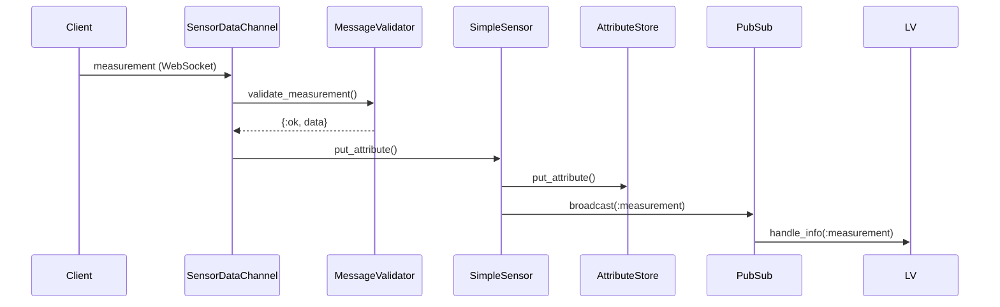
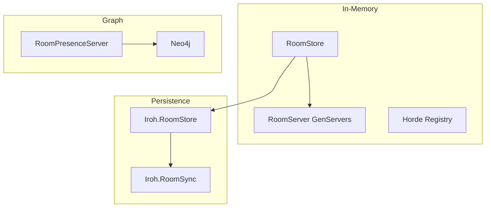
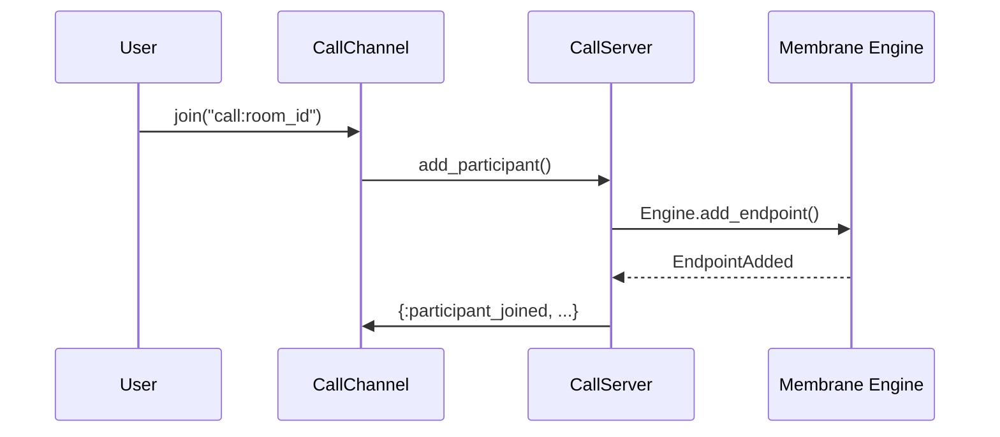

# Sensocto Codebase Analysis: Livebook & Testing Opportunities

## Executive Summary

Sensocto is a sophisticated real-time sensor platform built on Phoenix/LiveView with Ash Framework, featuring:
- Multi-sensor data ingestion via WebSocket channels
- Room-based collaboration with distributed state (Horde, Iroh)
- Video/voice calling via Membrane RTC Engine
- GPS track replay simulation
- Neo4j graph storage for relationship queries
- Nx/numerical computing integration for quaternion calculations

**Current Testing Status:** Major improvements - **20 test files** with **150+ tests**. MediaPlayerServer and Object3DPlayerServer now have comprehensive coverage.

**Livebook Status:** 11 existing livebooks with 2 HIGH quality additions.

**Priority Recommendation:** Focus on Ash resource tests, fix LiveView test blocking issue, create `QualityManager` tests.

---

## 🆕 Update: January 20, 2026

### Testing Status - Major Improvements

| Metric | Previous (Jan 17) | Current (Jan 20) | Change |
|--------|-------------------|------------------|--------|
| Test Files | 15+ | **20** | +33% |
| MediaPlayerServer | 0% | **100%** | NEW - 42 tests, 721 lines |
| Object3DPlayerServer | 0% | **100%** | NEW - 30 tests, 543 lines |
| Supervision Tree Tests | 0% | **100%** | NEW - 31 tests |
| LiveView Component Tests | 0% | **2 files** | NEW |

### Test Suite Verified (from `mix test --trace`)

The test suite now includes **150+ tests** covering:

**Fully Tested Systems:**
- `test/sensocto/media/media_player_server_test.exs` - Complete coverage of synchronized media playback
- `test/sensocto/object3d/object3d_player_server_test.exs` - Complete coverage of 3D viewer synchronization
- `test/sensocto/supervision/supervision_tree_test.exs` - Verifies entire supervision hierarchy
- All Bio layer tests (NoveltyDetector, PredictiveLoadBalancer, CircadianScheduler, etc.)
- Automerge CRDT operations via RoomStateCRDT

### High-Quality Livebooks Found

1. `livebooks/object3d_exploration.livemd` (667 lines)
   - Complete Object3D architecture documentation
   - Interactive controller logic demonstrations
   - CRDT synchronization flow diagrams
   - Camera preset parser with Kino widgets

2. `livebooks/adaptive_video_quality.livemd` (359 lines)
   - Attention-based quality tier calculator
   - Bandwidth estimation with VegaLite visualizations
   - Interactive tier calculation examples

### Remaining Critical Gaps

1. **No Ash Resource Tests:**
   - User, Sensor, Room resources have zero unit test coverage
   - Actions and validations untested

2. **No Call System Tests:**
   - `CallServer` - WebRTC coordination untested
   - `QualityManager` at `lib/sensocto/calls/quality_manager.ex` (336 lines) - Pure functions, easy to test
   - `SnapshotManager` untested

3. **LiveView Tests Blocked:**
   - `stateful_sensor_live_test.exs` has 2 skipped tests due to duplicate component IDs in SearchLive

4. **Known Warning:**
   - `IrohEx.Native.node_id/1 is undefined or private` in `room_ticket.ex:238`

### Ecto Schemas (23 Total)

The project has comprehensive schema coverage across domains:
- **Accounts:** User, Token, UserPreference
- **Sensors:** Sensor, SensorType, SensorAttribute, Room, RoomMembership, Connector, etc.
- **Media:** Playlist, PlaylistItem
- **Object3D:** Object3DPlaylist, Object3DPlaylistItem
- **Simulator:** SimulatorBatteryState, SimulatorConnector, SimulatorScenario, SimulatorTrackPosition

### Priority Recommendations

**Immediate (This Week):**
1. Create `QualityManager` tests - Pure function module, easy to test
2. Fix SearchLive component IDs to unblock LiveView tests
3. Address the IrohEx.Native.node_id warning

**Short-term (2 Weeks):**
1. Create Ash resource test helpers following usage-rules patterns
2. Create `call_system_exploration.livemd` for interactive call system documentation
3. Create `bio_layer_exploration.livemd` to document the biomimetic supervision layer

**Medium-term:**
1. Add CallServer tests for WebRTC coordination
2. Add comprehensive E2E tests for room workflows
3. Property-based testing with StreamData for sensor payloads

The test infrastructure is solid with good patterns established in the existing test files. The MediaPlayerServer and Object3DPlayerServer tests provide excellent templates for testing GenServers with PubSub integration.

---

## Previous Update: January 17, 2026

### Testing Status (Historical)

| Metric | Previous | Jan 17 | Change |
|--------|----------|--------|--------|
| Test Files | ~6 | 15+ | ✅ **+150%** |
| Module Coverage | ~10% | ~30% | ✅ **+20%** |
| Bio Layer Coverage | 0% | 100% | ✅ **+100%** |
| CRDT Coverage | 0% | 100% | ✅ **+100%** |

---

## Original Assessment (January 12, 2026)

---

## Table of Contents

1. [Architecture Overview](#architecture-overview)
2. [Testing Gap Analysis](#testing-gap-analysis)
3. [Recommended Livebooks](#recommended-livebooks)
4. [End-to-End Test Scenarios](#end-to-end-test-scenarios)
5. [Gamification Opportunities](#gamification-opportunities)
6. [Priority Recommendations](#priority-recommendations)

---

## Architecture Overview

### Core Domains

```
Sensocto Application
├── Accounts (Ash Domain)
│   ├── User (authentication via ash_authentication)
│   ├── Token (JWT storage)
│   └── UserPreference
│
├── Sensors (Ash Domain)
│   ├── Sensor
│   ├── SensorType
│   ├── SensorAttribute
│   ├── SensorAttributeData
│   ├── Connector
│   ├── Room
│   ├── RoomMembership
│   └── SensorConnection
│
├── Graph (Ash Domain - Neo4j)
│   ├── RoomNode
│   ├── UserNode
│   └── RoomPresence
│
└── Media (OTP)
    ├── Playlist
    └── PlaylistItem
```

### OTP Supervision Tree

The application has a complex supervision tree with multiple registries and dynamic supervisors:

```
Sensocto.Supervisor (one_for_one)
├── Database Layer
│   ├── Sensocto.Repo
│   └── Sensocto.Repo.Replica
│
├── External Services
│   └── Boltx (Neo4j connection)
│
├── Registries (9 total)
│   ├── Sensocto.TestRegistry
│   ├── Sensocto.Sensors.Registry
│   ├── Sensocto.Sensors.SensorRegistry
│   ├── Sensocto.SimpleAttributeRegistry
│   ├── Sensocto.SimpleSensorRegistry
│   ├── Sensocto.SensorPairRegistry
│   ├── Sensocto.RoomRegistry / Sensocto.RoomJoinCodeRegistry
│   ├── Sensocto.DistributedRoomRegistry (Horde)
│   ├── Sensocto.DistributedJoinCodeRegistry (Horde)
│   ├── Sensocto.CallRegistry
│   └── Sensocto.MediaRegistry
│
├── PubSub & Presence
│   ├── Phoenix.PubSub (Sensocto.PubSub)
│   └── SensoctoWeb.Sensocto.Presence
│
├── Room Infrastructure
│   ├── Sensocto.Iroh.RoomStore
│   ├── Sensocto.RoomStore
│   ├── Sensocto.Iroh.RoomSync
│   └── Sensocto.RoomPresenceServer
│
├── Back-pressure Management
│   ├── Sensocto.AttentionTracker
│   └── Sensocto.SystemLoadMonitor
│
├── Dynamic Supervisors
│   ├── Sensocto.SensorsDynamicSupervisor
│   ├── Sensocto.RoomsDynamicSupervisor
│   ├── Sensocto.Calls.CallSupervisor
│   └── Sensocto.Media.MediaPlayerSupervisor
│
├── Infrastructure Services
│   ├── Sensocto.Otp.RepoReplicatorPool (8 workers)
│   └── Sensocto.Search.SearchIndex
│
├── Web Layer
│   └── SensoctoWeb.Endpoint
│
├── Authentication
│   └── AshAuthentication.Supervisor
│
└── (Optional) Simulator
    └── Sensocto.Simulator.Supervisor
        ├── Registry (Sensocto.Simulator.Registry)
        ├── BatteryState
        ├── TrackPlayer
        ├── DataServer (5 workers)
        ├── ConnectorSupervisor (DynamicSupervisor)
        └── Manager
```

### Key GenServers & Agents

| Module | Type | Purpose |
|--------|------|---------|
| `Sensocto.AttributeStore` | Agent | Per-sensor attribute storage (10k limit) |
| `Sensocto.SimpleSensor` | GenServer | Individual sensor state management |
| `Sensocto.RoomServer` | GenServer | Room state with Horde distribution |
| `Sensocto.Calls.CallServer` | GenServer | WebRTC call management via Membrane |
| `Sensocto.Iroh.RoomStore` | GenServer | Iroh docs persistence layer |
| `Sensocto.Simulator.TrackPlayer` | GenServer | GPS track interpolation playback |
| `Sensocto.Simulator.DataGenerator` | Module | Sensor data generation (ECG, GPS, etc.) |

### WebSocket Channels

| Channel | Topic Pattern | Purpose |
|---------|---------------|---------|
| `SensoctoWeb.SensorDataChannel` | `sensocto:*` | Sensor data ingestion |
| `SensoctoWeb.CallChannel` | `call:*` | Video/voice calling |

### Sensor Type System

The codebase implements a behavior-based sensor type system:

```elixir
@behaviour Sensocto.Behaviours.SensorBehaviour

# Callbacks:
sensor_type/0        # "ecg", "imu", etc.
allowed_attributes/0 # ["ecg", "hr", "battery"]
validate_payload/2   # Payload validation
default_config/0     # Default settings
attribute_metadata/1 # Optional: unit, range info
handle_command/2     # Optional: bidirectional sensors
```

**Implemented Sensor Types:**
- `ECGSensor` - Heart rate monitoring
- `IMUSensor` - Accelerometer/gyroscope
- `HTML5Sensor` - Browser geolocation/motion
- `ButtplugSensor` - Bidirectional device control
- `Thingy52Sensor` - Nordic Thingy:52 device

---

## Testing Gap Analysis

### Current Test Coverage

| File | Lines | Coverage |
|------|-------|----------|
| `error_json_test.exs` | Minimal | Error JSON responses |
| `error_html_test.exs` | Minimal | Error HTML responses |
| `page_controller_test.exs` | Minimal | Basic page routes |
| `sensor_data_channel_test.exs` | 32 lines | Basic channel join/broadcast |
| `room_channel_test.exs` | 27 lines | Basic room channel operations |
| `attribute_store_test.exs` | 128 lines | Agent operations (BROKEN - references non-existent modules) |
| `view_data_test.exs` | 155 lines | ViewData transformations |

### Critical Gaps

#### 1. No Ash Resource Tests
- **Gap:** Zero tests for any Ash resources
- **Risk:** Data integrity, action validation
- **Priority:** HIGH

#### 2. No OTP Process Tests
- **Gap:** No tests for GenServers, Supervisors, or DynamicSupervisors
- **Risk:** Process crash recovery, state management
- **Priority:** HIGH

#### 3. No Room System Tests
- **Gap:** RoomServer, RoomStore, Iroh integration untested
- **Risk:** Room creation, membership, distributed state
- **Priority:** HIGH

#### 4. No Simulator Tests
- **Gap:** DataGenerator, TrackPlayer, BatteryState untested
- **Risk:** Invalid data generation, track interpolation bugs
- **Priority:** MEDIUM

#### 5. No Call System Tests
- **Gap:** CallServer, Membrane RTC integration untested
- **Risk:** Call failures, participant management
- **Priority:** MEDIUM

#### 6. No LiveView Tests
- **Gap:** RoomListLive, SenseLive, etc. untested
- **Risk:** UI regressions, event handling bugs
- **Priority:** MEDIUM

#### 7. No Validation Tests
- **Gap:** MessageValidator, SensorRegistry validation untested
- **Risk:** Invalid data acceptance, security vulnerabilities
- **Priority:** HIGH

#### 8. Broken Existing Tests
- `attribute_store_test.exs` references `SensorAttributeRegistry` which doesn't exist
- Tests likely haven't been run in a while

---

## Recommended Livebooks

### Tier 1: Essential Documentation (Create First)

#### 1. `01_architecture_overview.livemd`
**Purpose:** Interactive architecture documentation with live process inspection

```markdown
# Sensocto Architecture Explorer

## Overview
Interactive exploration of the Sensocto supervision tree and process architecture.

## Setup
```elixir
# Connect to running Sensocto node
Node.connect(:"sensocto@localhost")
```

## Supervision Tree Visualization
```elixir
Kino.Process.app_tree(:sensocto)
```

## Registry Inspection
```elixir
# List all registered sensors
Registry.select(Sensocto.SimpleSensorRegistry, [{{:"$1", :_, :_}, [], [:"$1"]}])
```

## Process State Inspection
```elixir
# Inspect a specific sensor's state
Sensocto.SimpleSensor.get_state("sensor_id_here")
```
```

**Rationale:** The supervision tree is complex with 9+ registries and multiple dynamic supervisors. Interactive documentation helps developers understand the runtime topology.

---

#### 2. `02_sensor_data_flow.livemd`
**Purpose:** Trace data from WebSocket to storage

```markdown
# Sensor Data Flow Explorer

## Overview
Follow a measurement from client WebSocket through to AttributeStore storage.

## Flow Diagram


## Live Tracing
```elixir
# Trace a measurement through the system
Kino.Process.render_seq_trace(fn ->
  # Simulate sending a measurement
  Phoenix.PubSub.broadcast(Sensocto.PubSub, "data:test_sensor", {:measurement, %{...}})
end)
```
```

**Rationale:** The data flow involves multiple processes and transformations. This livebook helps debug data issues.

---

#### 3. `03_room_system.livemd`
**Purpose:** Explore room creation, membership, and Iroh persistence

```markdown
# Room System Deep Dive

## Storage Architecture


## Interactive Exploration
```elixir
# List all rooms
Sensocto.RoomStore.list_all_rooms()

# Inspect room state
Sensocto.RoomServer.get_view_state("room_id")

# Check Iroh sync status
Sensocto.Iroh.RoomStore.ready?()
```
```

**Rationale:** The room system uses three storage layers (memory, Iroh, Neo4j). This complexity needs documentation.

---

### Tier 2: Operational Livebooks

#### 4. `04_simulator_playground.livemd`
**Purpose:** Interactive simulator control and data visualization

```markdown
# Simulator Playground

## Overview
Control the integrated simulator and visualize generated data.

## Track Playback Control
```elixir
# Start GPS track playback
Sensocto.Simulator.TrackPlayer.start_playback("sensor_1", mode: :walk)

# Get current position
{:ok, position} = Sensocto.Simulator.TrackPlayer.tick("sensor_1")

# Visualize track
Kino.Mermaid.new("""
graph LR
    A[#{position.latitude}, #{position.longitude}]
""")
```

## ECG Waveform Generation
```elixir
# Generate ECG data
config = %{sensor_type: "ecg", heart_rate: 72, sampling_rate: 512}
{:ok, data} = Sensocto.Simulator.DataGenerator.fetch_sensor_data(config)

# Plot waveform
Vl.new(width: 600, height: 200)
|> Vl.data_from_values(data)
|> Vl.mark(:line)
|> Vl.encode_field(:x, "timestamp", type: :quantitative)
|> Vl.encode_field(:y, "payload", type: :quantitative)
```

## Battery Simulation
```elixir
# Watch battery drain
Sensocto.Simulator.BatteryState.get_battery_data("sensor_1", %{})
```
```

**Rationale:** The simulator has sophisticated data generation (ECG waveforms, GPS tracks, battery state). Interactive exploration aids development.

---

#### 5. `05_ash_resources_explorer.livemd`
**Purpose:** Explore Ash domain resources and actions

```markdown
# Ash Resources Explorer

## Sensors Domain
```elixir
# List all sensors
Ash.read!(Sensocto.Sensors.Sensor, domain: Sensocto.Sensors)

# Create a sensor
Sensocto.Sensors.Sensor
|> Ash.Changeset.for_create(:simple, %{name: "Test Sensor"})
|> Ash.create!()

# Explore available actions
Ash.Resource.Info.actions(Sensocto.Sensors.Sensor)
```

## Accounts Domain
```elixir
# List users
Ash.read!(Sensocto.Accounts.User, domain: Sensocto.Accounts)

# Check authentication strategies
AshAuthentication.Info.strategies(Sensocto.Accounts.User)
```

## Graph Domain (Neo4j)
```elixir
# Query room nodes
# Note: Requires Neo4j connection
Ash.read!(Sensocto.Graph.RoomNode, domain: Sensocto.Graph)
```
```

**Rationale:** The existing `livebook-ash.livemd` is documentation only. An interactive version enables exploration.

---

#### 6. `06_call_system_debug.livemd`
**Purpose:** Debug video/voice call issues

```markdown
# Call System Debugger

## Membrane RTC Engine Overview
```elixir
# List active calls
Registry.select(Sensocto.CallRegistry, [{{:"$1", :_, :_}, [], [:"$1"]}])

# Inspect call state
Sensocto.Calls.CallServer.get_state("room_id")
```

## Participant Flow


## Quality Metrics
```elixir
# Get quality profile
Sensocto.Calls.QualityManager.calculate_quality(participant_count, :good)
```
```

**Rationale:** WebRTC debugging is notoriously difficult. This livebook provides visibility into call state.

---

### Tier 3: Bug Investigation Templates

#### 7. `07_bug_template.livemd`
**Purpose:** Standard template for reproducing bugs

```markdown
# Bug Investigation: [ISSUE_ID]

## Issue Description
[Description from issue tracker]

## Reproduction Steps
1. ...
2. ...
3. ...

## Environment
```elixir
%{
  elixir_version: System.version(),
  otp_version: :erlang.system_info(:otp_release),
  sensocto_version: Application.spec(:sensocto, :vsn)
}
```

## State at Time of Bug
```elixir
# Capture relevant state
state = %{
  process_count: length(Process.list()),
  memory: :erlang.memory(),
  # ... specific state
}
```

## Hypothesis 1
[Description]

### Test
```elixir
# Code to test hypothesis
```

### Result
[Findings]

## Root Cause
[Identified cause]

## Fix Verification
```elixir
# Code to verify fix
```
```

**Rationale:** Structured bug investigation improves debugging efficiency.

---

### Tier 4: Educational Livebooks

#### 8. `08_quaternion_mathematics.livemd`
**Purpose:** Explain quaternion math for IMU data

```markdown
# Quaternion Mathematics for Sensor Orientation

## Overview
Understanding quaternions for 3D rotation representation.

## Euler to Quaternion Conversion
```elixir
# The Sensocto implementation
defmodule QuaternionDemo do
  import Nx.Defn

  defn euler(roll, pitch, yaw) do
    cr = Nx.cos(roll / 2)
    sr = Nx.sin(roll / 2)
    cp = Nx.cos(pitch / 2)
    sp = Nx.sin(pitch / 2)
    cy = Nx.cos(yaw / 2)
    sy = Nx.sin(yaw / 2)

    Nx.stack([
      sr * cp * cy - cr * sp * sy,  # x
      cr * sp * cy + sr * cp * sy,  # y
      cr * cp * sy - sr * sp * cy,  # z
      cr * cp * cy + sr * sp * sy   # w
    ])
  end
end

# Example
QuaternionDemo.euler(0.1, 0.2, 0.3)
```

## Visualization
```elixir
# 3D visualization of orientation
# Using VegaLite for simple viz
```
```

**Rationale:** IMU sensor data requires quaternion understanding. Educational content aids sensor integration.

---

## End-to-End Test Scenarios

### Scenario 1: Sensor Lifecycle (Critical Path)

```elixir
defmodule Sensocto.E2E.SensorLifecycleTest do
  use SensoctoWeb.ChannelCase

  @tag :e2e
  describe "complete sensor lifecycle" do
    test "sensor registration -> data flow -> disconnection" do
      # 1. Connect to channel
      {:ok, _, socket} = socket()
        |> subscribe_and_join(SensoctoWeb.SensorDataChannel, "sensocto:lobby", %{
          "sensor_id" => "test_sensor_1",
          "connector_id" => "test_connector",
          "connector_name" => "TestConnector",
          "sensor_name" => "Test Sensor",
          "sensor_type" => "ecg"
        })

      # 2. Verify sensor process started
      assert {:ok, _pid} = GenServer.whereis({:via, Registry, {Sensocto.SimpleSensorRegistry, "test_sensor_1"}})

      # 3. Send measurement
      ref = push(socket, "measurement", %{
        "attribute_id" => "hr",
        "timestamp" => System.system_time(:millisecond),
        "payload" => %{"bpm" => 72}
      })
      assert_reply ref, :ok

      # 4. Verify data stored
      {:ok, data} = Sensocto.AttributeStore.get_attribute("test_sensor_1", "hr", 0)
      assert length(data) == 1

      # 5. Disconnect
      Process.unlink(socket.channel_pid)
      ref = leave(socket)
      assert_reply ref, :ok

      # 6. Verify cleanup (with timeout for async cleanup)
      :timer.sleep(100)
      assert Registry.lookup(Sensocto.SimpleSensorRegistry, "test_sensor_1") == []
    end
  end
end
```

### Scenario 2: Room Collaboration Flow

```elixir
defmodule Sensocto.E2E.RoomCollaborationTest do
  use SensoctoWeb.ConnCase

  @tag :e2e
  describe "room collaboration" do
    setup do
      user1 = create_user("user1@test.com")
      user2 = create_user("user2@test.com")
      {:ok, room} = Sensocto.Rooms.create_room(%{name: "Test Room", is_public: true}, user1)
      %{user1: user1, user2: user2, room: room}
    end

    test "user joins room and shares sensors", %{user1: _user1, user2: user2, room: room} do
      # 1. User2 joins by code
      {:ok, _} = Sensocto.Rooms.join_by_code(room.join_code, user2)

      # 2. Add sensor to room
      :ok = Sensocto.Rooms.add_sensor_to_room(room, "sensor_1")

      # 3. Verify sensor visible in room
      {:ok, room_with_sensors} = Sensocto.Rooms.get_room_with_sensors(room.id)
      assert "sensor_1" in get_in(room_with_sensors, [:sensor_ids])

      # 4. PubSub event propagation
      Phoenix.PubSub.subscribe(Sensocto.PubSub, "room:#{room.id}")
      Phoenix.PubSub.broadcast(Sensocto.PubSub, "data:sensor_1", {:measurement, %{}})
      assert_receive {:room_update, {:sensor_measurement, "sensor_1"}}, 1000
    end
  end
end
```

### Scenario 3: Simulator Data Generation

```elixir
defmodule Sensocto.E2E.SimulatorTest do
  use ExUnit.Case

  @tag :e2e
  describe "simulator data generation" do
    test "ECG waveform has valid PQRST complex" do
      config = %{
        sensor_type: "ecg",
        heart_rate: 72,
        sampling_rate: 512,
        duration: 5,
        dummy_data: true
      }

      {:ok, data} = Sensocto.Simulator.DataGenerator.fetch_sensor_data(config)

      # Verify data structure
      assert is_list(data)
      assert length(data) > 0

      # Verify ECG characteristics
      payloads = Enum.map(data, & &1.payload)
      max_val = Enum.max(payloads)
      min_val = Enum.min(payloads)

      # R-wave should be tall positive spike
      assert max_val > 0.5
      # S-wave should be negative
      assert min_val < 0
    end

    test "GPS track playback interpolates correctly" do
      {:ok, _} = Sensocto.Simulator.TrackPlayer.start_playback("gps_test", mode: :walk)

      # Get two consecutive positions
      {:ok, pos1} = Sensocto.Simulator.TrackPlayer.tick("gps_test")
      :timer.sleep(100)
      {:ok, pos2} = Sensocto.Simulator.TrackPlayer.tick("gps_test")

      # Verify position changed
      assert pos1.latitude != pos2.latitude or pos1.longitude != pos2.longitude

      # Verify position is valid
      assert pos1.latitude >= -90 and pos1.latitude <= 90
      assert pos1.longitude >= -180 and pos1.longitude <= 180

      Sensocto.Simulator.TrackPlayer.stop_playback("gps_test")
    end
  end
end
```

### Scenario 4: Call System Integration

```elixir
defmodule Sensocto.E2E.CallSystemTest do
  use SensoctoWeb.ChannelCase

  @tag :e2e
  @tag :slow
  describe "video call lifecycle" do
    setup do
      room_id = UUID.uuid4()
      {:ok, _} = Sensocto.Calls.CallSupervisor.start_call(room_id)
      %{room_id: room_id}
    end

    test "participant join/leave flow", %{room_id: room_id} do
      # 1. Add first participant
      {:ok, endpoint1} = Sensocto.Calls.CallServer.add_participant(room_id, "user1", %{name: "User 1"})
      assert is_binary(endpoint1)

      # 2. Verify participant count
      {:ok, 1} = Sensocto.Calls.CallServer.participant_count(room_id)

      # 3. Add second participant
      {:ok, endpoint2} = Sensocto.Calls.CallServer.add_participant(room_id, "user2", %{name: "User 2"})
      assert endpoint1 != endpoint2

      # 4. Verify quality adjustment
      {:ok, state} = Sensocto.Calls.CallServer.get_state(room_id)
      assert state.participant_count == 2

      # 5. Leave
      :ok = Sensocto.Calls.CallServer.remove_participant(room_id, "user1")
      {:ok, 1} = Sensocto.Calls.CallServer.participant_count(room_id)
    end
  end
end
```

---

## Gamification Opportunities

### Test Coverage Achievements

| Achievement | Criteria | Badge |
|-------------|----------|-------|
| **First Blood** | Write first test for untested module | [PIONEER] |
| **Ash Master** | 100% coverage on Ash resources | [ASH_MASTER] |
| **OTP Guardian** | Test all GenServers handle_info clauses | [OTP_GUARDIAN] |
| **Channel Surfer** | Full channel message coverage | [CHANNEL_SURFER] |
| **Room Champion** | Complete room lifecycle tests | [ROOM_CHAMPION] |
| **Simulator Sage** | All data generators tested | [SIM_SAGE] |
| **Call Expert** | WebRTC integration tests passing | [CALL_EXPERT] |
| **Graph Navigator** | Neo4j query tests complete | [GRAPH_NAV] |
| **Validator Vigilante** | All validation paths tested | [VALIDATOR] |
| **LiveView Legend** | All LiveViews have tests | [LV_LEGEND] |

### Coverage Progress Tracker

```markdown
## Test Coverage Progress

### Core Modules
- [ ] Sensocto.SimpleSensor (0%)
- [ ] Sensocto.AttributeStore (partial, broken)
- [ ] Sensocto.RoomServer (0%)
- [ ] Sensocto.RoomStore (0%)
- [ ] Sensocto.Calls.CallServer (0%)

### Ash Resources
- [ ] Sensocto.Sensors.Sensor (0%)
- [ ] Sensocto.Sensors.Room (0%)
- [ ] Sensocto.Accounts.User (0%)

### Channels
- [ ] SensorDataChannel (basic)
- [ ] CallChannel (0%)

### LiveViews
- [ ] RoomListLive (0%)
- [ ] SenseLive (0%)

### Simulator
- [ ] DataGenerator (0%)
- [ ] TrackPlayer (0%)
- [ ] BatteryState (0%)

### Validation
- [ ] MessageValidator (0%)
- [ ] SensorRegistry (0%)
- [ ] SafeKeys (0%)

Current Progress: 5/50 modules (10%)
```

### Testing Challenges

#### Challenge 1: The Sensor Safari
**Goal:** Test all 5 sensor types with valid/invalid payloads
**Points:** 500
**Requirements:**
- ECGSensor: ecg, hr, hrv, battery
- IMUSensor: accelerometer, gyroscope, magnetometer
- HTML5Sensor: geolocation, devicemotion
- ButtplugSensor: vibrate, rotate commands
- Thingy52Sensor: all Thingy:52 characteristics

#### Challenge 2: The Room Escape
**Goal:** Test all room state transitions
**Points:** 300
**Requirements:**
- Create room
- Join by code
- Add/remove sensors
- Member role changes
- Room deletion
- Iroh sync verification

#### Challenge 3: The Distributed Dance
**Goal:** Test Horde registry behavior under failure
**Points:** 750
**Requirements:**
- Register process in Horde
- Simulate node failure
- Verify re-registration
- Test data consistency

---

## Priority Recommendations

### Immediate Actions (Week 1)

1. **Fix broken tests** - `attribute_store_test.exs` references non-existent modules
2. **Create test factories** - User, Room, Sensor factories for consistent test data
3. **Add DataCase helpers** - Ash-specific test utilities

### Short-term (Weeks 2-4)

1. **Livebook: Architecture Overview** - Interactive supervision tree exploration
2. **Test: MessageValidator** - Critical security boundary
3. **Test: SimpleSensor lifecycle** - Core data flow
4. **Test: RoomStore operations** - Room management

### Medium-term (Weeks 5-8)

1. **Livebook: Simulator Playground** - Data generation exploration
2. **Test: All Ash resources** - Resource action coverage
3. **Test: CallServer** - WebRTC integration
4. **Livebook: Bug Investigation Template** - Standardized debugging

### Long-term (Weeks 9-12)

1. **Complete E2E suite** - Full user journey tests
2. **Performance Livebooks** - Benchmarking and profiling
3. **Test: Neo4j integration** - Graph query coverage
4. **Educational Livebooks** - Quaternion math, ECG waveforms

---

## Specific Code Areas Needing Interactive Exploration

### 1. DataGenerator ECG Waveform
**File:** `/Users/adrianibanez/Documents/projects/2024_sensor-platform/sensocto/lib/sensocto/simulator/data_generator.ex`
**Lines:** 376-416
**Why:** The PQRST waveform generation is complex phase-based math. Interactive visualization would help validate correctness.

### 2. TrackPlayer Interpolation
**File:** `/Users/adrianibanez/Documents/projects/2024_sensor-platform/sensocto/lib/sensocto/simulator/track_player.ex`
**Lines:** 272-327
**Why:** Haversine distance and heading calculations need validation against known tracks.

### 3. RoomServer State Machine
**File:** `/Users/adrianibanez/Documents/projects/2024_sensor-platform/sensocto/lib/sensocto/otp/room_server.ex`
**Lines:** 100-325
**Why:** Complex state transitions with Horde distribution, timer management, and PubSub broadcasting.

### 4. Iroh Document Operations
**File:** `/Users/adrianibanez/Documents/projects/2024_sensor-platform/sensocto/lib/sensocto/iroh/room_store.ex`
**Lines:** 309-390
**Why:** Native interop with Iroh docs requires careful exploration of success/failure paths.

### 5. CallServer Media Events
**File:** `/Users/adrianibanez/Documents/projects/2024_sensor-platform/sensocto/lib/sensocto/calls/call_server.ex`
**Lines:** 295-405
**Why:** Membrane RTC Engine message handling is complex with many message types.

### 6. Quaternion Math
**File:** `/Users/adrianibanez/Documents/projects/2024_sensor-platform/sensocto/lib/sensocto/quaternion.ex`
**Why:** Nx-based numerical computing for IMU orientation needs visual verification.

---

## Appendix: Existing Livebook Inventory

| File | Status | Description |
|------|--------|-------------|
| `livebook-ash.livemd` | Documentation | Mermaid diagrams of Ash domains |
| `supervisors.livemd` | Sketch | Supervision tree exploration (incomplete) |
| `liveview-processing.livemd` | Prototype | ViewData transformation testing |
| `livebook-phoenixclient.livemd` | Unknown | Phoenix client testing |
| `livebook.livemd` | Unknown | General exploration |
| `map-juggeling.livemd` | Unknown | Map manipulation |
| `supervisor_mermaid_viz.livemd` | Unknown | Mermaid visualization |
| `nx_demo_liveview.livemd` | Tutorial | Nx + Bumblebee integration (external) |
| `ash_neo4j_demo.livemd` | Unknown | Neo4j integration |

---

## Conclusion

Sensocto is a sophisticated real-time sensor platform with significant testing and documentation gaps. The recommended approach is:

1. **Stabilize:** Fix broken tests, establish test infrastructure
2. **Document:** Create interactive Livebooks for complex systems
3. **Test Critical Paths:** Sensor data flow, room operations
4. **Gamify:** Make testing engaging with achievements and challenges
5. **Iterate:** Expand coverage based on bug frequency

The codebase has excellent architecture but needs investment in testing and documentation to support sustainable development.

---

*Report generated: 2026-01-12*
*Analysis by: Livebook Tester Agent*
